# SapaLOQ — Development Blueprint (Proposal)

> **Unified synthesis** of all SapaLOQ architecture docs. Single book for implementers, reviewers, and future contributors.
> Last updated: 2026-06-21 (flat unrestricted tool surface) · Status: architecture target; implementation truth lives in [STATUS.md](./STATUS.md)

---

## Document control


| Field                    | Value                                                 |
| ------------------------ | ----------------------------------------------------- |
| **Version**              | 0.1.0-proposal                                        |
| **Status**               | M0 — docs complete, code not started                  |
| **Audience**             | Core implementers, product owner, future contributors |
| **Language**             | Indonesian / English mix (matches source docs)        |
| **Authoritative config** | [config.schema.json](../schema/config.schema.json)    |
| **This file**            | Synthesis only — modular docs remain source of detail |


### How to read this document

1. **Executives / new readers** — Part I (summary) + Part XVII (limitations) + Part XVIII (roadmap).
2. **Implementers** — Part IV (architecture) → Part V–XIII (subsystems) → Part XIX (Go layout) → Part XX (testing).
3. **Integrators (LLM / platform)** — Part X (platform) + Part XI (bridge) + Appendix A (events).
4. **Ops / packaging** — Part XIII (runtime) + Part XV (filesystem) + systemd section in Part XIII.

When this blueprint and a modular doc disagree, **modular doc wins** until explicitly revised here.

### Modular doc index (quick)


| Doc                                                          | Focus                                     |
| ------------------------------------------------------------ | ----------------------------------------- |
| [VISION.md](./VISION.md)                                     | Visi, misi, non-goals, product surface    |
| [ORCHESTRATOR.md](./ORCHESTRATOR.md)                         | Ask/Plan/Agent, spawn, control, progress  |
| [CONTEXT-SOP.md](./CONTEXT-SOP.md)                           | Anti-forget, SQLite, ingress pipeline     |
| [PROMPT-BUILDER-SOP.md](./PROMPT-BUILDER-SOP.md)             | Pre/post spawn prompts, skills builder    |
| [FEEDBACK-SOP.md](./FEEDBACK-SOP.md)                         | RL-inspired behavioral shaping            |
| [RUNTIME.md](./RUNTIME.md)                                   | Single binary, concurrency, systemd       |
| [EVENT-BUS.md](./EVENT-BUS.md)                               | In-proc pub/sub, topics, socket           |
| [PLATFORM.md](./PLATFORM.md)                                 | `platform.Desktop`, adapters, `desktop_`* |
| [DRIVER.md](./DRIVER.md)                                     | OS detect, `os.json`, driver registry     |
| [BRIDGE.md](./BRIDGE.md)                                     | LLM bridge drivers, parsers, poisoning    |
| [RE-CURSOR-THINKING-TOOLS.md](./RE-CURSOR-THINKING-TOOLS.md) | L0 wire truth for Cursor thinking/tools   |
| [NODES.md](./NODES.md)                                       | Local vs remote sub-agent nodes           |
| [LIMITATIONS.md](./LIMITATIONS.md)                           | Hard limits, honest UX contract           |
| [README.md](./README.md)                                     | Entry point, status M0                    |


---

## Part I — Executive Summary

### Elevator pitch

> **SapaLOQ** — portable desktop companion (HUD + memory + platform adapter), GNOME first — dengan handoff opsional ke coding agent. Satu binary Go, SQLite + jsonl, zero Redis. Widget agent = orchestrator saja; pekerjaan berat ke sub-agent.

User merasakan *presence* agent di desktop (ring animasi, thinking, tool feedback) tanpa membuka IDE — sambil tetap bisa **handoff** ke worker (`cursor-agent`, GoClaw) kalau butuh coding berat.

### Problem


| Pain                         | Detail                                                                                                        |
| ---------------------------- | ------------------------------------------------------------------------------------------------------------- |
| **Agent coding ≠ companion** | `cursor-agent` / IDE optimized untuk repo tasks — terlalu berat untuk "catat ini", remind, desktop automation |
| **Memory campur**            | Shared transcript dengan coding agent → context poisoning, mode leak (personal vs work)                       |
| **Compaction failures**      | Agent lupa skills, deep-check repo, over-read files saat context penuh                                        |
| **No ambient presence**      | User harus buka terminal/IDE untuk "agent feel"                                                               |
| **Settings UI overhead**     | Companion config berubah sering — agent-editable JSON lebih natural                                           |


### Solution

SapaLOQ = **dua produk terpisah** + optional bridge:


|         | **SapaLOQ (Companion)**                          | **Worker (Agent CLI)**       |
| ------- | ------------------------------------------------ | ---------------------------- |
| Feel    | Ambient HUD, ngobrol santai                      | Task execution, coding       |
| Brain   | LLM bridge driver (`cursor-bridge`, compat APIs) | `cursor-agent` / GoClaw      |
| Memory  | `~/.config/sapaloq/`                             | `~/.cursor/`, agent sessions |
| MCP     | Desktop adapter (`desktop_`*)                    | git, fs, terminal, repo      |
| Default | Always-on widget                                 | Explicit handoff only        |


Core runtime: **orchestrator-only widget** → spawn sub-agents dengan context packet minimal → progress streaming tanpa blocking → SQLite index anti-lupa.

### Key differentiators

1. **Isolasi penuh** dari agent-cli — bukan wrapper, bukan shared session.
2. **Orchestrator + sub-agent** — widget koordinasi; workers agresif & parallel.
3. **Context SOP** — index-first prefetch, dynamic system-prompt, anti-deep-check.
4. **Config-by-agent** — `/settings ...` → sub-agent patch `config.json`; **no settings UI**.
5. **Single binary** — goroutine + in-proc bus + SQLite; no Redis/Rabbit/MQTT.
6. **Platform abstraction** — GNOME first adapter; portable `desktop_`* tools.
7. **LLM bridge layer** — built-in parsers (tools/thinking); cursor-bridge coercion; **NOT** 9router dep.
8. **Remote nodes** — sub-agent on VPS/Docker; **no shared memory** to outer machines.
9. **RL-inspired feedback** — positive/negative slices + bandit on prefetch — **not** weight training.
10. **Honest limitations** — documented hard limits; no fake "always aware" marketing.

### What we're NOT building

- Reimplement protobuf Cursor (`aiserver.v1`, `agent.v1`) di widget.
- Replace `cursor-agent` / IDE / 9router sebagai coding brain.
- Shared memory dengan `~/.cursor/`, acp-sessions, agent jsonl.
- Full 49 ToolCall handlers di companion (cloud worker tools).
- Parity Cursor IDE (browser automation, computer-use, PR tools).
- Settings panel / preferences UI.
- External message broker / Redis as runtime dependency.
- Require 9router as third-party dependency.
- Derive Cursor thinking behavior from 9router transport.
- Shared SQLite memory bus across remote nodes.

See [LIMITATIONS.md](./LIMITATIONS.md) for hard limits with no engineering solution.

---

## Part II — Product Vision & UX

### Floating HUD widget

> **UI locked:** [UI-DECISION.md](./UI-DECISION.md) · M5a spike validated (Wails v2, FAB+popup, GTK input shape).

Referensi visual: floating orb/FAB pojok layar (squircle, neon blue), expandable chat popup, ring animator.


| Property  | Behavior                                                           |
| --------- | ------------------------------------------------------------------ |
| Position  | Draggable FAB; persist `~/.config/sapaloq/widget/position.json`    |
| Collapsed | 48×48 window; circular GTK input shape (click-through outside orb) |
| Expanded  | Popup ~360×520 above FAB; anchor bottom-left                       |
| Layer     | Always-on-top (GJS shim on GNOME Wayland; layer-shell on KDE/Sway) |
| IPC       | Thin client → `sapaloq.sock`                                       |


**Click → panel:**

- Chat companion (bukan agent transcript).
- Mode companion (bukan clone `--mode` cursor-agent 1:1):
  - **Chat** — ngobrol + desktop automation.
  - **Automate** — fokus `desktop_`* actions.
  - **Handoff** — siapkan packet ke worker agent, buka terpisah.

### Ring states (animator)


| State           | Trigger                                                 | Widget behavior                    |
| --------------- | ------------------------------------------------------- | ---------------------------------- |
| `idle`          | Tidak ada aktivitas                                     | Slow pulse                         |
| `thinking`      | Companion brain streaming; sub-agent `type: thinking`   | Deep pulse                         |
| `tool-active`   | Extended tool jalan (`desktop_`*)                       | Tool icon animation                |
| `interactive`   | Butuh input user (confirm, pilih window, clarification) | Needs-input highlight              |
| `blocked`       | Hook deny / policy                                      | Error tint                         |
| `delegating`    | N sub-agents active                                     | Count badge + last progress mirror |
| `mirror-worker` | Optional: listen worker events tanpa ingest memory      | Visual only                        |


Config: `widget.ringAnimations`, `widget.mirrorSubAgentActivity`.

### Companion vs worker

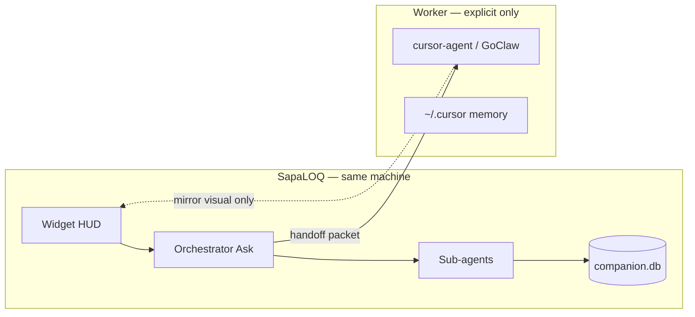


**Hard boundaries:**

1. Widget **tidak** spawn `cursor-agent` di main loop.
2. **Tidak** shared sqlite/jsonl antara companion dan worker.
3. **Tidak** shared MCP config file.
4. Handoff = **aksi eksplisit** user ("Open in Agent").
5. `cursor-agent-toolcall-spec` = referensi visual + mirror UI only.

### Handoff UX

User flow:

1. User selesai merancang intent di SapaLOQ (Ask/Plan).
2. User taps **Handoff** atau says "buka di agent".
3. SapaLOQ writes `bridge/handoff/<uuid>.json` (consumeOnce).
4. Worker dibuka terpisah (terminal `agent`, IDE, GoClaw).
5. Widget optional **mirror-worker** ring state — **no** transcript ingest.

### Config-by-agent (no settings UI)

```
User:  /settings matiin read notification kamu dong
Orchestrator: spawn sub-agent:settings
Settings:     config.json → notifications.read = false
Orchestrator: "Notifikasi read-aloud sudah off."
```

Semua preference mutasi via chat + `/settings` sub-agent. Schema validation against [config.schema.json](../schema/config.schema.json).

**Recovery path (no UI):** `sapaloq-core doctor`, manual edit `config.json`, CLI `detect --force`.

### Mode awareness (personal / hobby / work)


| Mode     | storageRoot                    | memoryNamespace |
| -------- | ------------------------------ | --------------- |
| personal | `~/Documents/sapaloq/personal` | `personal`      |
| hobby    | `~/Documents/sapaloq/hobby`    | `hobby`         |
| work     | `~/Documents/sapaloq/work`     | `work`          |


Default `orchestrator.defaultMode: auto` — infer from active app, time, user hint.
`allowCrossModeRead: false` — boundary-guard blocks cross-mode leaks unless user confirms.

---

## Part III — Architecture Principles

Fifteen numbered principles dengan rationale — anchor untuk semua design decisions.


| #   | Principle                           | Rationale                                                          |
| --- | ----------------------------------- | ------------------------------------------------------------------ |
| 1   | **Single binary runtime**           | Less deps, one systemd unit, no broker SPOF cascade                |
| 2   | **Orchestrator-only widget**        | Keeps HUD responsive; heavy work delegated                         |
| 3   | **Never block on sub-agents**       | Fire-and-forget spawn + progress watch + event completion          |
| 4   | **Index-first context**             | SQLite FTS prefetch <2s; grep/fs only on low confidence            |
| 5   | **Task-scoped context packets**     | Anti context poisoning; no silent task blend                       |
| 6   | **Compaction-safe memory**          | Durable state in index + files; transcript not source of truth     |
| 7   | **Config-by-agent, no settings UI** | Agent-native config; schema-validated mutations                    |
| 8   | **Isolation from coding agents**    | Companion memory ≠ worker memory; explicit handoff                 |
| 9   | **Platform adapter swap**           | Core never imports GNOME types; `desktop_`* uniform tools          |
| 10  | **Two driver families**             | Platform (`os.json`) ≠ LLM bridge (`llmBridge.driver`)             |
| 11  | **Per-provider parsers**            | Tool/thinking formats differ; wrong parser = silent tool loss      |
| 12  | **Local shared memory only**        | Remote nodes get context packet in, progress out — no live DB sync |
| 13  | **In-proc event bus**               | Wake <5ms; jsonl WAL for audit; no Redis                           |
| 14  | **RL-inspired not weight training** | Prompt slices + SQLite facts + bandit — auditable, local           |
| 15  | **Honest UX contract**              | Document hard limits; proactive only while running                 |


**Corollaries:**

- Ask + Plan front-load restrictions → Agent (`task-runner`) gets **full tool access** by default.
- Thinking pre-tag → widget ring only; **strip** from companion memory by default.
- 9router = transport **pattern reference** only — built-in compat bridges, not third-party dep.

---

## Part IV — System Architecture

### Single binary diagram

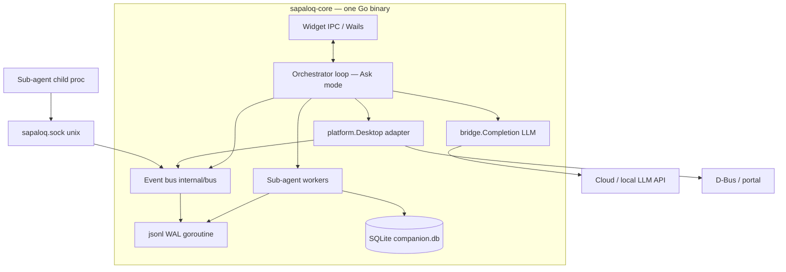


### Component table


| Component           | Package (target)                   | Responsibility                                  |
| ------------------- | ---------------------------------- | ----------------------------------------------- |
| **Widget IPC**      | `internal/ui/`                     | Ring states, chat panel, progress mirror        |
| **Orchestrator**    | `internal/core/orchestrator/`      | Ask mode routing, task stack, spawn, control    |
| **Intent router**   | `internal/core/intent/`            | Classify intent, spawn path scores              |
| **Context scaler**  | `internal/core/context/`           | Prefetch merge, context packet, anti-deep-check |
| **Boundary guard**  | `internal/core/boundary/`          | Mode/cross-mode policy                          |
| **Sub-agent pool**  | `internal/core/subagent/`          | Spawn, lifecycle, progress emit                 |
| **Event bus**       | `internal/bus/`                    | Publish, route watchers, dedupe                 |
| **WAL appender**    | `internal/bus/wal/`                | Async jsonl append                              |
| **SQLite store**    | `internal/store/`                  | Facts, FTS, nodes, prefetch_rules               |
| **Platform driver** | `internal/drivers/`*               | GNOME, KDE, freedesktop, windows, headless      |
| **OS detect**       | `internal/detect/`                 | Probe, fingerprint, os.json                     |
| **LLM bridge**      | `internal/bridges/`*               | cursor-bridge, openai-compat, local-llama       |
| **Parsers**         | `internal/parse/tools`, `thinking` | Wire format → canonical model                   |
| **Node client**     | `internal/nodes/`                  | Remote spawn WS/HTTP                            |
| **Learning hook**   | `internal/learning/`               | Post-task queue, janitor drain                  |


### Data flow: user → ask → plan → agent

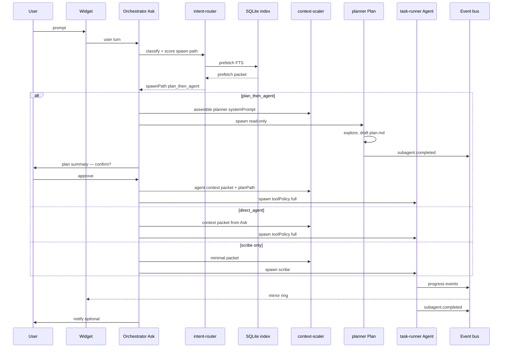


**Latency note:** Internal bus wake <5ms. LLM first token = 200ms–30s+ (external, documented hard limit).

---

## Part V — Orchestrator & Execution Modes

### Ask = orchestrator, Plan = planner, Agent = task-runner

Analog Cursor IDE: **Ask**, **Plan**, **Agent** — di SapaLOQ = orchestrator + sub-agent roles, bukan clone wire `UNIFIED_MODE` api2.


| Cursor mode | SapaLOQ role                | Tool policy                                                         | Job                                 |
| ----------- | --------------------------- | ------------------------------------------------------------------- | ----------------------------------- |
| **Ask**     | **Orchestrator** (widget)   | Companion only: `spawn`, `desktop_*`, read progress/memory, clarify | Route, score spawn path, delegate   |
| **Plan**    | Sub-agent `**planner`**     | **Read-only** — explore, draft plan, no mutating side effects       | Produce Markdown `plan.md` artifact |
| **Agent**   | Sub-agent `**task-runner`** | **Full access (default)**                                           | Execute plan or explicit user steps |


**Prinsip:** Ask + Plan sudah merancang pekerjaan → Agent **tidak perlu restriction tambahan** beyond global boundary (mode) dan `maxTurns`. Restriction di front-load ke orchestrator + planner.

Config lock: `orchestrator.spawnRouting.agentToolPolicy: "full"` (only enum value).

### Orchestrator responsibilities (MUST)

- Parse user intent; classify mode.
- Run **context ingress** — intent-router → index prefetch → dynamic prompt.
- Maintain **task stack** (active, parked, done).
- Spawn sub-agents with `**systemPrompt` per role** + **context packet**.
- Update widget ring state.
- **Subscribe progress stream** — mirror ke widget.
- **React to event bus** — notifications, reminders, completion.
- **Never block** on sub-agent completion.
- **Control lifecycle** — delay_start, pause, resume, stop, delete.

### Orchestrator MUST NOT

- Run grep, write large files, embed memory, long LLM chains.
- Hold full conversation history in prompt.
- Spawn `cursor-agent` implicitly.

### Spawn routing scores

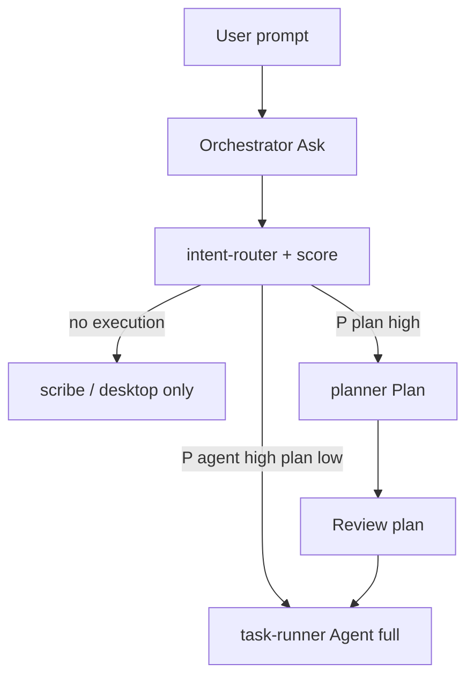


| Signal                            | ↑ P(plan) | ↑ P(direct agent)    |
| --------------------------------- | --------- | -------------------- |
| Multi-step / multi-file           | ✓         |                      |
| Ambiguous goal                    | ✓         |                      |
| Destructive / cross-boundary risk | ✓         |                      |
| User gave explicit step list      |           | ✓                    |
| Single-shot / scribe / notify     |           | ✓ (often skip agent) |
| High confidence + low risk        |           | ✓                    |


Intent-router output example:

```json
{
  "intent": "execute_task",
  "confidence": 0.82,
  "spawnPath": "plan_then_agent",
  "scores": { "plan": 0.71, "directAgent": 0.38, "scribeOnly": 0.05 },
  "reason": "multi_file_refactor_ambiguous_scope"
}
```


| `spawnPath`       | Behavior                                                                 |
| ----------------- | ------------------------------------------------------------------------ |
| `none`            | Orchestrator jawab / scribe / desktop only                               |
| `direct_agent`    | Spawn `task-runner` dengan context packet dari Ask                       |
| `plan_then_agent` | Spawn `planner` → Markdown plan artifact → spawn agent dengan `planPath` |


Config thresholds:

- `orchestrator.spawnRouting.planScoreThreshold` — default **0.55**
- `orchestrator.spawnRouting.directAgentScoreThreshold` — default **0.7**

### Plan artifact

Planner writes `memory/tasks/<taskId>/plan.md`. This follows Cursor/Copilot Plan mode: the plan is a user-readable Markdown artifact, not an opaque JSON blob.

```markdown
---
planId: plan-001
taskId: task-001
mode: work
status: draft
createdBy: planner
---

# Plan: Refactor config schema validation

## Goal
Refactor config schema validation without touching Cursor worker memory.

## Constraints
- mode=work
- no touch `~/.cursor`
- preserve existing config bootstrap behavior

## Steps
- [ ] Read `config.schema.json` and current config loader.
- [ ] Add `spawnRouting` validation fields.
- [ ] Update `config.example.json`.
- [ ] Run config/load tests.

## Risks
- Schema drift between docs and bootstrap config.

## Acceptance
- [ ] Config validates.
- [ ] Example config bootstraps.
```

### Plan review gate


| Policy                                 | When                                                    |
| -------------------------------------- | ------------------------------------------------------- |
| `autoApprovePlan: false` (**default**) | Orchestrator surfaces plan → user confirm → spawn agent |
| `autoApprovePlan: true`                | Low-risk patterns only (configurable allowlist — TBD)   |


Planner **never** spawns agent — orchestrator only. The runtime binds a plan
through an explicit validated `plan_task_id`; it never guesses from the latest
planner directory in the session.

### task-runner spawn payload (post-plan or direct)

```json
{
  "role": "task-runner",
  "executionMode": "agent",
  "toolPolicy": "full",
  "contextPacket": {
    "taskId": "task-001",
    "planId": "plan-001",
    "planPath": "~/.config/sapaloq/memory/tasks/task-001/plan.md",
    "userSnippet": "..."
  },
  "systemPrompt": "<assembled from roles/task-runner.md + overlays>",
  "maxTurns": 32
}
```

### Slash commands (orchestrator routes)


| Command         | Handler              | Effect                     |
| --------------- | -------------------- | -------------------------- |
| `/settings ...` | sub-agent `settings` | Patch allowed config paths |


MVP exposes no other user-facing slash command. Mode, task control, scribe/note-taking, and ngobrol flows remain natural-language orchestration until a later product decision enables them in `commands.registry`.

---

## Part VI — Sub-agent Ecosystem

### All roles table


| Role               | Trigger                      | Tool policy          | Primary job                                        |
| ------------------ | ---------------------------- | -------------------- | -------------------------------------------------- |
| **orchestrator**   | Every user turn              | `companion`          | **Ask mode** — route, spawn score, delegate, watch |
| **settings**       | `/settings ...`              | Config R/W only      | Patch `config.json`                                |
| **scribe**         | "catat ini", notes           | Append tools         | Write `storage.paths` by mode/intent               |
| **planner**        | `spawnPath: plan_then_agent` | `**read_only`**      | Draft Markdown `plan.md` — no mutating exec        |
| **task-runner**    | Post-plan or `direct_agent`  | `**full`**           | Execute designed task                              |
| **intent-router**  | Every prompt (pre-hook)      | Heuristic / tiny LLM | Classify intent, prefetch, spawn scores            |
| **context-scaler** | Every delegation             | —                    | Minimal context packet; anti-deep-check            |
| **boundary-guard** | Before delegation            | —                    | Reject cross-mode leaks                            |
| **memory-janitor** | Auto / idle / schedule       | Index tools          | Dedupe, compact, drain learning_queue              |
| **learning-agent** | Post `subagent.completed`    | —                    | Prompt overlay + skills builder                    |
| **research**       | learning-agent / novel task  | Web fetch            | Best practice → facts + skill draft                |
| **event-watcher**  | `events.watchers`            | Platform read        | GNOME/custom → event bus                           |


Role templates: `~/.config/sapaloq/prompt/roles/{role}.md`.
Config: `subAgents.roles` in [config.schema.json](../schema/config.schema.json).

### Sub-agent lifecycle states


| State                    | Meaning                          |
| ------------------------ | -------------------------------- |
| `scheduled`              | delay_start — belum spawn        |
| `pending`                | Spawned, belum turn pertama      |
| `in_progress`            | Aktif                            |
| `paused`                 | Orchestrator pause               |
| `awaiting_clarification` | Sub-agent pause — tunggu jawaban |
| `stopping`               | Cooperative shutdown             |
| `stopped`                | Cancelled                        |
| `done`                   | Success                          |
| `failed`                 | Error                            |
| `deleted`                | Detached from task               |


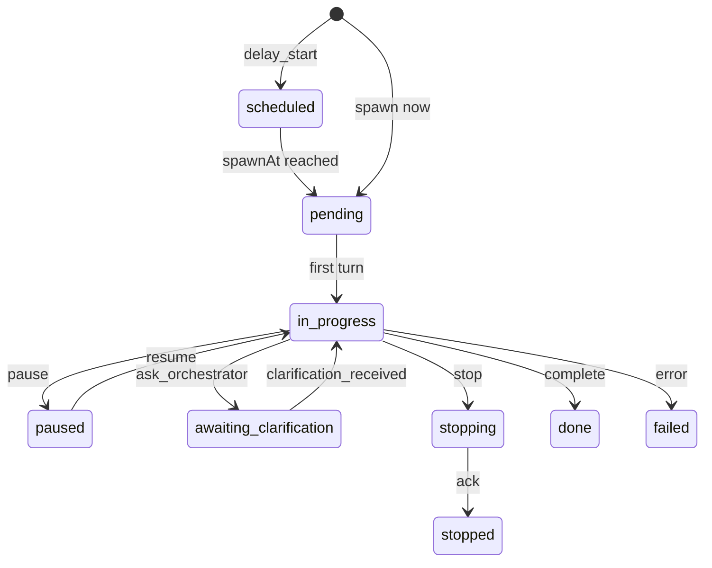


### Clarification loop

Sub-agent **tidak nebak** saat unclear — emit `clarification_request`, pause (`awaiting_clarification`).

**Path 1 — Orchestrator auto-answer** (confidence ≥ `clarification.autoAnswerMinConfidence`, default 0.75):

Sources: `config.json` snapshot, SQLite facts, active task mode, pre-resolved context packet.

**Path 2 — Forward to user:** Widget shows question + quick reply buttons.

Timeouts: `clarification.userTimeoutSec` default 300 → re-prompt once → `defaultOnTimeout: park`.

**Anti-blocker:** Clarification pins **one** sub-agent; orchestrator + widget stay responsive.

Every role template **must** include "When unclear" section — see [PROMPT-BUILDER-SOP.md](./PROMPT-BUILDER-SOP.md).

### Progress streaming

Append-only: `memory/progress/<subAgentId>.jsonl`

Orchestrator tails stream (inotify / bus topic) — holds **slim snapshot** per active sub-agent, not full history.

User asks *"scribe lagi ngapain?"* → orchestrator reads snapshot + tail N (`progressStreaming.tailEventsOnAsk`, default 10).

### Control plane

Control file: `memory/control/<subAgentId>.json`
Bus topic: `sapaloq.v1.orchestrator.control.{subAgentId}`


| Action        | Effect                                               |
| ------------- | ---------------------------------------------------- |
| `delay_start` | Register `spawnAt`; pre-built context stored         |
| `pause`       | Freeze before next turn                              |
| `resume`      | Continue from checkpoint — no full transcript replay |
| `stop`        | Cooperative cancel                                   |
| `delete`      | Detach from task; cleanup per `progressRetention`    |


Config: `orchestrator.subAgentControl.`*

### Anti-blocker design summary


| Principle               | Implementation                                      |
| ----------------------- | --------------------------------------------------- |
| Orchestrator fast       | max ~3 turns; delegate immediately                  |
| Async sub-agents        | goroutine / child proc; events on complete          |
| Parallel when safe      | janitor + scribe concurrent if different namespaces |
| Widget responsive       | ring shows count + last progress event              |
| Completion non-blocking | bus primary; heartbeat watchdog only                |


---

## Part VII — Context, Memory & Anti-Forget

### Problem (Cursor-style failure modes)


| Symptom           | Penyebab                            |
| ----------------- | ----------------------------------- |
| **Lupa**          | Skill/memory hilang saat compaction |
| **Deep check**    | Explore repo/fs dari nol            |
| **Over-read**     | Baca 10+ file sebelum aksi          |
| **Static prompt** | Monolith system prompt              |
| **No index**      | Grep/file walk only                 |


SapaLOQ target: **prefetch context tepat dalam <2 detik** sebelum sub-agent jalan.

### Context ingress pipeline

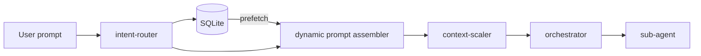


**Fase 0 — Ingress (<100ms, no LLM if possible):**

- Parse mode (personal/hobby/work/auto)
- Classify intent (heuristic + optional tiny LLM)
- Match task stack + poison check
- Lookup `prefetch_rules`

**Fase 1 — Index prefetch (<500ms):**

1. Hot cache (in-proc LRU)
2. Facts by namespace
3. FTS5 keywords + intent tags
4. Skills index (max `skills.maxLoadPerTurn`, default 2)
5. Storage/apps intent → path id

Prefetch packet example:

```json
{
  "confidence": 0.82,
  "intent": "catat",
  "mode": "personal",
  "facts": [{ "kind": "preference", "key": "notes_target", "value": "personal-notes" }],
  "skills": [{ "id": "sapaloq-scribe", "path": "~/.config/sapaloq/skills/scribe.md" }],
  "storagePathId": "personal-notes",
  "antiDeepCheck": true
}
```

**Fase 2 — Dynamic system-prompt assembly** — see Part VIII.

**Fase 3 — Context packet** → sub-agent.

### Anti-deep-check SOP


| Condition                 | Action                                          |
| ------------------------- | ----------------------------------------------- |
| `confidence >= 0.7`       | **No explore** — act on prefetch                |
| `0.4 <= confidence < 0.7` | Max 2 index queries + 1 file read               |
| `confidence < 0.4`        | Max 3 files, 2 tool calls, 30s budget           |
| Compaction / low context  | **Reload from index** — never replay transcript |
| User repeat within 5 min  | Serve hot_cache                                 |


Orchestrator **reject** unbounded grep/glob/read unless context-scaler escalates.
Log overrides → learning_queue → prefetch rule tuning.

### SQLite schema summary

Path: `~/.config/sapaloq/memory/companion.db` — **only** persistence engine. Full DDL: [CONTEXT-SOP.md](./CONTEXT-SOP.md) · [NODES.md](./NODES.md).


| Table                 | Purpose                                 | Key columns                                           |
| --------------------- | --------------------------------------- | ----------------------------------------------------- |
| `facts` + `facts_fts` | Authoritative memory + FTS5 search      | namespace, kind, key, value, confidence, obsolete_at  |
| `skills_index`        | SapaLOQ-local skills registry           | id, triggers (JSON), path, max_tokens                 |
| `prefetch_rules`      | Intent → prefetch mapping; bandit stats | intent_pattern, skill_ids, hit_count, success_rate    |
| `prompt_slices`       | Dynamic prompt templates                | role, conditions (JSON), template_path, token_budget  |
| `learning_queue`      | Async learning events                   | event_kind, payload, processed_at                     |
| `hot_cache`           | Optional restart warm-up                | cache_key, payload, expires_at                        |
| `prefetch_log`        | Telemetry for rule tuning               | confidence, deep_check_used, task_success, latency_ms |
| `feedback_events`     | Reward/penalty log                      | task_id, reward, signal                               |
| `nodes`               | Sub-agent node registry                 | name, role, wrapper, communicate, share_memory        |


Example `facts` row + FTS trigger pattern:

```sql
INSERT INTO facts (id, namespace, kind, key, value, updated_at)
VALUES ('f-001', 'personal', 'preference', 'notes_target', 'personal-notes', datetime('now'));
-- Query: SELECT * FROM facts_fts WHERE facts_fts MATCH 'catat' AND namespace = 'personal';
```

**Memory kinds:** `index`, `preference`, `routine`, `contact`, `touch-map`, `validation`, `debug` (do_not_repeat), `decision`, `obsolete`, `maintenance`, `best_practice`.

Optional markdown mirror: `memory/files/{namespace}/YYYY-MM-DD-{slug}-{kind}.md`

### Task stack anti-poisoning

Task stack persisted under `memory/tasks/`:

```json
{
  "activeTaskId": "task-001",
  "stack": [{
    "id": "task-001",
    "status": "running",
    "mode": "work",
    "summary": "Rangkum email klien",
    "subAgents": [{
      "id": "sub-abc",
      "role": "task-runner",
      "lifecycle": "in_progress"
    }]
  }],
  "parked": []
}
```

**Rules (`orchestrator.antiContextPoisoning`):**

1. `blockNewTaskUntilParkOrDone` — task B while A running → park/switch/finish prompt
2. `requireExplicitTaskSwitch` — new task = new taskId + fresh packet
3. Context packets **task-scoped** — never inject other tasks' history
4. `parkInactiveAfterMinutes` — auto-park stale tasks (default 30)

Context packet (context-scaler output):

```json
{
  "taskId": "task-001",
  "mode": "personal",
  "intent": "catat",
  "userSnippet": "beli susu besok",
  "targetPathId": "personal-notes",
  "relevantFacts": ["..."],
  "excludedTasks": ["task-002"],
  "prefetch": { "confidence": 0.82, "antiDeepCheck": true }
}
```

### Boot index sync

On `sapaloq-core` start:

1. Load `config.json` → index storage.paths, apps.entries, events.watchers
2. Scan `skills/*.md` → skills_index
3. Scan `memory/files/**/*.md` → facts + FTS
4. Load prompt slices → prompt_slices
5. Bootstrap `nodes` row `local-default`

Incremental: inotify on skills + memory files.

### Auto-learning loop (overview)

Post-task `learning-agent` → `learning_queue` → `memory-janitor` drains → facts / prefetch_rules / roles.d overlays.

Triggers: success + `buildOnSuccess`, user 👎, novel intent, repeated failure ≥2.

---

## Part VIII — Prompt Builder & Learning

### Two assemblers (pre-spawn vs post-task)


| Phase         | Actor                         | Output                               | Latency budget              |
| ------------- | ----------------------------- | ------------------------------------ | --------------------------- |
| **Pre-spawn** | orchestrator + context-scaler | Role `systemPrompt` + context packet | <500ms deterministic        |
| **During**    | sub-agent                     | Progress stream                      | —                           |
| **Post-task** | learning-agent                | roles.d overlay, skills, facts       | Async — never blocks widget |
| **Research**  | research sub-agent            | Web best practice                    | Async, bounded              |


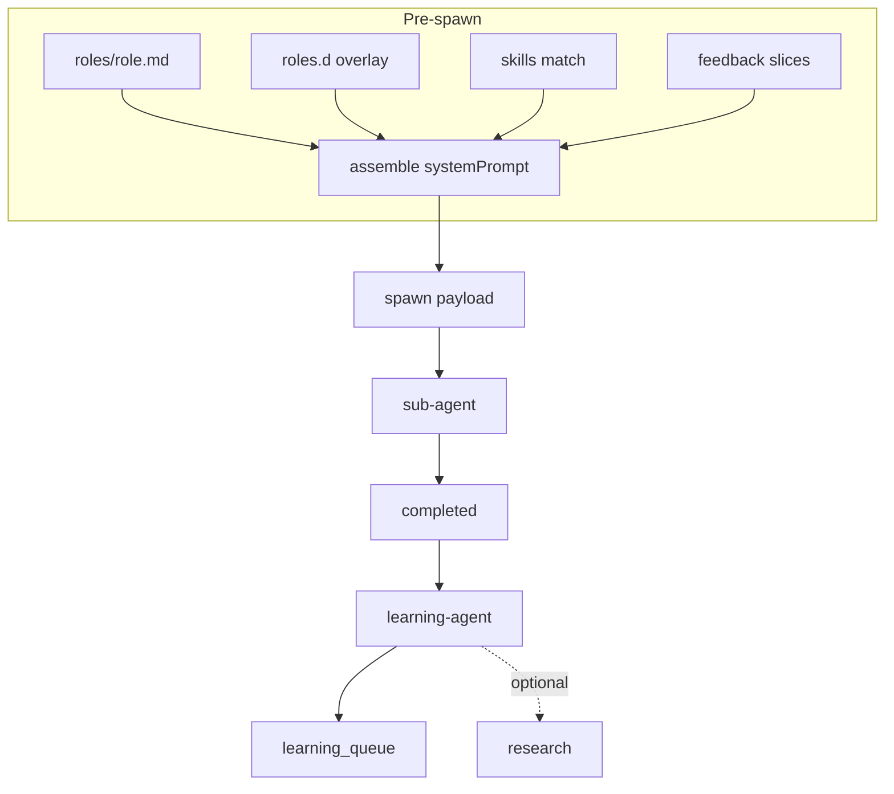


### Assembly formula (pre-spawn)

```text
systemPrompt =
  roles/{role}.md
  + roles.d/{role}-{intent}.md   (if exists)
  + task slice (from context packet)
  + prefetch facts (bounded)
  + skills[] (max skills.maxLoadPerTurn)
  + do_not_repeat + negative slice (if penalty)
  + positive slice (if low success_rate)
```

**Orchestrator prompt ≠ sub-agent prompt.**

Orchestrator layers (token budget guide):


| Layer     | Max tokens | When            |
| --------- | ---------- | --------------- |
| core      | ~400       | Always          |
| mode      | ~200       | Always          |
| task      | ~300       | Active task     |
| prefetch  | ~600       | From index      |
| skill     | ~800 each  | Max N skills    |
| ephemeral | ~200       | Status ask only |


Role templates live in `prompt/roles/{role}.md` — each must include Must / Must not / When unclear sections. Seed list: orchestrator, settings, scribe, planner, task-runner, context-scaler, memory-janitor, learning-agent, research, event-watcher. Example scribe rules: append-only via storage.intents; no config.json edit; ask_orchestrator when boundary unclear.

### Post-task learning-agent

Adaptasi **automation-learning** — companion namespace, bukan repo path.


| Event                        | Spawn learning-agent?               |
| ---------------------------- | ----------------------------------- |
| `subagent.completed` success | If `learning.buildOnSuccess`        |
| User 👎 or correction        | Always                              |
| Same intent failed 2x        | Always + optional research          |
| Novel intent                 | Always + research if enabled        |
| Routine catat success        | Skip if reward < `minRewardToBuild` |


**Prefer overlay over base mutation:**

```text
prompt/roles/scribe.md           # human seed — jarang overwrite
prompt/roles.d/scribe-catat.md   # auto — learning-agent
```

### Research sub-agent (async, bounded)

Spawn when: novel intent + no skill, task_failed ≥2, user explicit, learning-agent gap.

Output → learning_queue:

```json
{
  "event_kind": "research_complete",
  "payload": {
    "topic": "gnome notification automation",
    "sources": [{ "url": "...", "title": "..." }],
    "best_practices": ["..."],
    "proposedSkillId": "gnome-notify-dnd"
  }
}
```

Safety: `learning.research.enabled`, mode boundary, cache TTL, `requireSourceUrl`.
**Never** auto-apply sensitive domains without user notify.

### Skills builder

Frontmatter example:

```yaml
---
id: sapaloq-scribe-catat
triggers: [catat, catat ini]
namespace: personal
role: scribe
priority: 10
max_tokens: 600
load_policy: on-intent
---
```

Load policies: `always-orchestrator`, `on-intent`, `on-mode`, `never-auto`.

Create via agent: `/settings buatin skill ...` → write file + upsert skills_index + prefetch_rule.

---

## Part IX — Feedback & Behavioral Shaping

### Verdict: RL-inspired, not weight training


| Approach                         | MVP?    | Why                        |
| -------------------------------- | ------- | -------------------------- |
| PPO / RLHF fine-tune             | ❌       | Mahal, infra, drift        |
| Reward + index update            | ✅ Core  | Cepat, lokal, auditable    |
| Positive/negative prompt slices  | ✅ Core  | Analog t2i negative prompt |
| Good/bad exemplars (Codex-style) | ✅ Core  | Cheap at inference         |
| Contextual bandit on prefetch    | ✅ Later | Lightweight "RL" tanpa GPU |
| Explicit user penalty (👎)       | ✅ Core  | Ground truth               |


**Analogi:**

```text
t2i:     prompt + negative_prompt  →  steer diffusion
SapaLOQ: positive_slice + negative_slice + do_not_repeat  →  steer LLM
```

### Three layers (stacked)

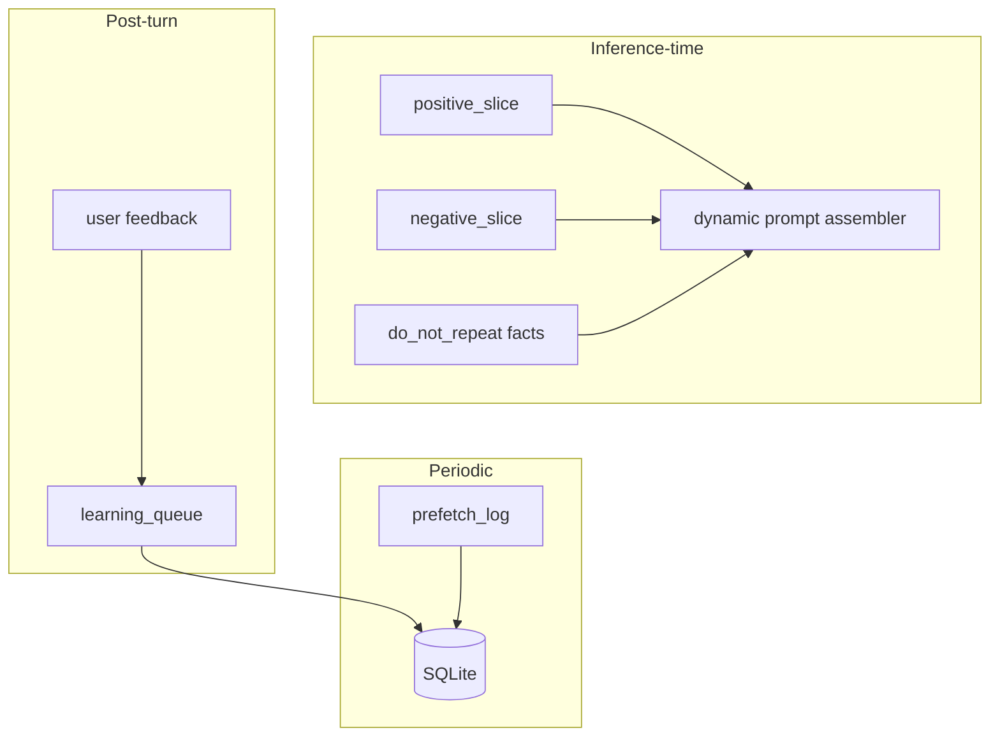


### Reward / penalty signals

**Explicit (user):**


| Signal            | reward              |
| ----------------- | ------------------- |
| 👍 / "mantap"     | +1                  |
| 👎 / "salah"      | -1                  |
| Correction text   | -1 + structured fix |
| Re-ask same thing | -0.5                |


**Implicit (telemetry):**


| Signal                       | reward             |
| ---------------------------- | ------------------ |
| Task success + no deep_check | +0.5               |
| deep_check + user 👎         | -0.8               |
| Wrong namespace blocked      | -1 (training data) |


Store: `feedback_events` + mirror hot cases to `learning_queue`.

### Positive / negative slices

```text
~/.config/sapaloq/prompt/
  positive/
    delegate-fast.md
    mode-boundary.md
    settings-patch.md
  negative/
    no-deep-check.md
    no-blocking.md
    no-cross-mode.md
```

Dynamic injection (max 1 positive + 1 negative per turn):

```json
{
  "positiveSlices": ["delegate-fast"],
  "negativeSlices": ["no-deep-check"],
  "doNotRepeat": ["2026-06-18: wrote work-inbox while mode=personal"]
}
```

### Penalty → durable memory

```json
{
  "event_kind": "penalty",
  "payload": {
    "namespace": "personal",
    "kind": "debug",
    "do_not_repeat": "spawn task-runner for simple catat — use scribe",
    "reward": -1,
    "userQuote": "keknya kepanjangan, catat aja langsung"
  }
}
```

memory-janitor: upsert fact, lower prefetch_rule success_rate, add negative slice trigger if ≥2 repeats.

### Contextual bandit (optional)

- **State:** intent, mode, confidence
- **Actions:** sub-agent choice, prefetch_rule, skill pair
- **Reward:** user feedback + task success + latency

Update on `prefetch_rules`:

```sql
-- success_rate = (success_rate * hit_count + reward) / (hit_count + 1)
```

Config: `feedback.banditTunePrefetch` default true.

### Anti-patterns

- Fine-tune local LLM on every 👎
- Huge negative prompt dump
- Penalize orchestrator for user task switch
- Store raw angry transcript as fact

---

## Part X — Platform & Drivers

### Platform abstraction

```
sapaloq-core (portable)
├── orchestrator · bus · SQLite · widget IPC
├── internal/platform.Desktop (interface)
├── drivers/gnome (MVP)
├── drivers/kde, freedesktop, windows, headless (later)
└── os.json cache (DRIVER.md)
```


| Layer                     | GNOME-specific? |
| ------------------------- | --------------- |
| Orchestrator, bus, SQLite | ❌               |
| Desktop automation        | ✅ per adapter   |
| Notification watch        | ✅ per adapter   |


**GNOME first, not GNOME-only.** MVP: Ubuntu/Pop!/Debian GNOME. Windows later.

### `platform.Desktop` interface (summary)

Capabilities: `notify`, `notify.watch`, `screenshot`, `window.list`, `window.focus`, `clipboard`, `dnd`, `tray`.

Methods: `NotifySend`, `NotifyWatch`, `Windows`, `FocusWindow`, `Screenshot`, `ClipboardRead/Write`, `DNDEnabled`.

Core calls `**desktop_*`** tools — never import GNOME types in orchestrator.

### Portable tool naming


| Legacy               | Portable               |
| -------------------- | ---------------------- |
| `gnome_notify`       | `desktop_notify`       |
| `gnome_screenshot`   | `desktop_screenshot`   |
| `gnome_focus_window` | `desktop_focus_window` |
| `gnome_*`            | `desktop_*`            |


Capability check: if `CapScreenshot` missing → orchestrator explains "not supported on this adapter".

### GNOME Phase 1 (no Shell extension required)


| Capability               | Backend                                |
| ------------------------ | -------------------------------------- |
| Watch/send notifications | D-Bus `org.freedesktop.Notifications`  |
| Screenshot               | xdg-desktop-portal                     |
| Window list/focus        | gnome-desktop-mcp **optional** backend |
| DND                      | gsettings / portal                     |


`gnome-desktop-mcp` = accelerator on dev machine, **not** global runtime dep.

### Driver boot flow (`os.json`)

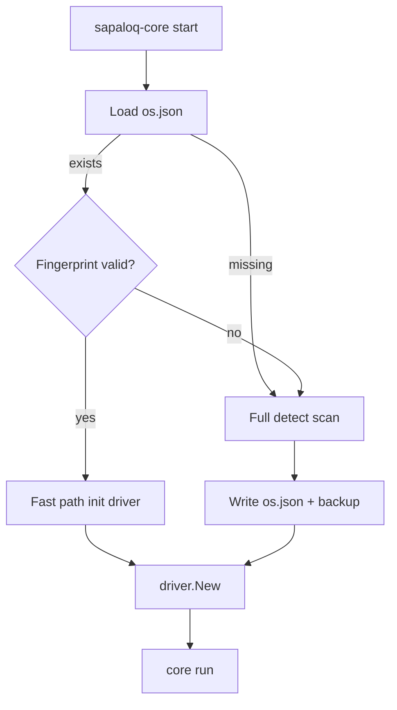


**Fast path <10ms:** read os.json, cheap env probe, match fingerprint.

**Slow path:** full probe `/etc/os-release`, `$XDG_CURRENT_DESKTOP`, D-Bus names → score drivers → backup old cache.

### `os.json` example (generated — not hand-edited)

```json
{
  "schemaVersion": "1.0.0",
  "generatedAt": "2026-06-19T10:00:00Z",
  "fingerprint": "sha256:abc123...",
  "probe": {
    "goos": "linux",
    "distroId": "ubuntu",
    "distroVersion": "24.04",
    "desktop": "GNOME",
    "sessionType": "wayland",
    "xdgCurrentDesktop": "ubuntu:GNOME"
  },
  "selectedDriver": "gnome",
  "capabilities": ["notify", "notify.watch", "screenshot", "window.list", "window.focus", "clipboard", "dnd"]
}
```

Config vs os.json:


| File          | Writer                     | Purpose               |
| ------------- | -------------------------- | --------------------- |
| `config.json` | User/agent via `/settings` | Preferences           |
| `os.json`     | **sapaloq-core detect**    | Cached OS/DE + driver |


Agent **reads** os.json for capability checks — does **not** rescan OS normally.

CLI: `sapaloq-core detect`, `detect --force`, `doctor`.

### Auto-detect order

Config `driver.detectOrder`: `["gnome", "kde", "freedesktop", "windows", "headless"]`

Override: `driver.override: gnome` skips scoring.

### Event topics (platform-neutral)

Prefer `sapaloq.v1.platform.notification`, `sapaloq.v1.platform.focus.changed`.
Legacy alias `sapaloq.v1.gnome.`* deprecated but supported.

---

## Part XI — LLM Bridge Layer

### Two driver families (do not mix)


| Family         | Package             | Selection                          |
| -------------- | ------------------- | ---------------------------------- |
| **Platform**   | `internal/drivers/` | `os.json` + detect                 |
| **LLM bridge** | `internal/bridges/` | `config.json` → `llmBridge.driver` |


```
sapaloq-core
├── bridge/          LLM registry
├── bridges/         cursor-bridge, openai-compat, claude-compat, local-llama
└── parse/
    ├── tools/       openai, claude, cursor, kimi
    └── thinking/    cursor, claude, kimi, openai
```

### cursor-bridge as first-class built-in driver

**NOT** runtime dep to `jahrulnr/cursor-bridge` or 9router — SapaLOQ **embeds/syncs schema at build**.


|                | SapaLOQ            | cursor-bridge monorepo | 9router                   |
| -------------- | ------------------ | ---------------------- | ------------------------- |
| Role           | Runtime driver     | Schema source of truth | Pattern reference only    |
| Dep            | Built-in           | Dev reference          | **Tidak** third-party dep |
| Tool poisoning | Parser + sanitizer | leakMarkers            | Partial                   |


Unified interface:

```go
type Bridge interface {
    ID() string
    Capabilities() BridgeCaps
    Complete(ctx context.Context, req CompletionRequest) (<-chan StreamEvent, error)
}
```

### Tool poisoning matrix


| Backend                    | Poisoning?     | Notes                 |
| -------------------------- | -------------- | --------------------- |
| OpenAI / OpenRouter direct | Usually **no** | Standard tool_calls   |
| Claude API direct          | Usually **no** | tool_use blocks       |
| **Cursor API**             | **Yes**        | Fake names → coercion |
| **Kimi via Cursor Auto**   | **Yes**        | Inline tokens         |
| Gemini / Copilot paths     | **Possible**   | Probe at connect      |


Coercion config:

```json
"llmBridge": {
  "driver": "cursor-bridge",
  "parsers": { "tools": "cursor", "thinking": "cursor" },
  "coercion": {
    "enabled": true,
    "schemaPath": "~/.config/sapaloq/bridge/cursor-bridge.schema.json"
  },
  "credentialsEnv": "SAPALOQ_CURSOR_TOKEN",
  "fallback": { "driver": "local-llama", "on": ["auth_error", "offline"] }
}
```

Credentials **never** in config.json.

### Parser layer — tools

Canonical internal model `parse.ToolCall`. Per-driver parsers:


| Parser     | Wire                             | Quirks                    |
| ---------- | -------------------------------- | ------------------------- |
| **cursor** | Protobuf TOOL_CALL + Kimi inline | Dual channel              |
| **openai** | delta.tool_calls[]               | Parallel index field      |
| **claude** | content[] tool_use               | Block IDs                 |
| **kimi**   | Inline markers in thinking tail  | Sub-parser of cursor Auto |


### Parser layer — thinking

**Do NOT derive from 9router** — it collapses/skips thinking channel.


| Parser     | Format                                                      |
| ---------- | ----------------------------------------------------------- |
| **cursor** | THINKING_TEXT blob: pre/post `</think>`, optional Kimi tail |
| **claude** | Extended thinking blocks                                    |
| **openai** | reasoning / o-series deltas                                 |
| **kimi**   | Inline after thinking split                                 |


Default policy:


| Output                | Policy                                          |
| --------------------- | ----------------------------------------------- |
| Pre-redacted thinking | Stream → ring `thinking`; **strip** from SQLite |
| Post-redacted         | User-visible content                            |
| Kimi tool tail        | → tools/kimi parser                             |


### L0 RE summary (see [RE-CURSOR-THINKING-TOOLS.md](./RE-CURSOR-THINKING-TOOLS.md))

**Truth hierarchy:** L0 = api2.cursor.sh + cursor-agent CLI protobuf; L0.5 = cursor-bridge.schema.json; **❌ 9router** = transport only (collapses thinking — not reference).

**Wire:** `StreamUnifiedChatWithTools` — separate `TOOL_CALL` frames vs `RESPONSE` with `THINKING_TEXT` blob (pre/post `</think>`, optional Kimi inline tail).

**Three tool paths:** (1) protobuf ClientSideToolV2Call, (2) Kimi inline when `toolCallsCount=0`, (3) schema "leak" in thinking — detect only.

**SapaLOQ must NOT:** collapse pre-tag thinking like 9router; audit content-only for leaks; assume Auto emits OpenAI tool_calls[].

**SapaLOQ must:** dual-channel until parser; pre-tag → ring not memory; Kimi parse on combined text; coercion for fake tool names.

### Sub-agent bridge usage


| Role         | Typical bridge                |
| ------------ | ----------------------------- |
| Orchestrator | `llmBridge.driver` default    |
| task-runner  | Same or node override         |
| research     | openai-compat / claude-compat |
| scribe       | local-llama or cheap compat   |


Remote node: credentials stay on orchestrator machine unless comm spec declares delegation.

### Built-in compat roadmap (not 9router fork)


| Driver ID       | Wire               | Poisoning  |
| --------------- | ------------------ | ---------- |
| `local-llama`   | llama.cpp sidecar  | N/A        |
| `openai-compat` | OpenAI HTTP        | Low        |
| `claude-compat` | Anthropic Messages | Low–medium |
| `cursor-bridge` | api2.cursor.sh     | **High**   |


Community bridges: compile-time registry; template for IDE-like backends.

---

## Part XII — Nodes & Remote Execution

### Concept

```
Orchestrator (local sapaloq-core)
    ├── node:local-default     (in-proc)
    ├── node:vps-scribe        (HTTP/WS)
    ├── node:docker-task       (container)
    └── node:ec2-research      (remote)
```

Core orchestrator **always** on user machine (widget). Node = **where sub-agent runs**.

### Memory policy: local vs remote


|                      | Same machine       | Outer machine             |
| -------------------- | ------------------ | ------------------------- |
| Shared companion.db? | ✅ Local sub-agents | ❌ **Not recommended**     |
| What remote gets     | Full memory bus    | **Context packet only**   |
| What remote returns  | —                  | Progress + result summary |
| Learning promotion   | Local janitor      | Local after completed     |


**Why no shared memory to remote:**

1. Latency — FTS useless over RTT
2. Stale memory — divergent truth
3. Sync complexity — out of scope for single binary

Remote contract:

```json
{
  "spawn": {
    "systemPrompt": "...",
    "contextPacket": { "taskId", "mode", "userSnippet", "relevantFacts" },
    "noMemoryBus": true
  },
  "return": { "progressStream": true, "resultSummary": "..." }
}
```

Same-host Docker: `share_memory: 0` default; explicit opt-in dev only.

### nodes table (SQLite)

See Part VII schema. Key columns:


| Column         | Example                                         |
| -------------- | ----------------------------------------------- |
| name           | `vps-scribe`                                    |
| role           | `scribe`                                        |
| wrapper        | `local` | `docker` | `vps` | `ec2` | `ssh`      |
| communicate    | `unix` | `http` | `ws` | `mcp` | `grpc` | `ssh` |
| comm_spec_path | `~/.config/sapaloq/nodes/vps-scribe.md`         |
| share_memory   | 0 for remote                                    |


### Comm spec (SKILL-like)

`nodes/{name}.md` — operating manual: endpoints, auth env vars, spawn protocol, control ack, boundaries, failure retry.

Agent: `/settings register node vps-scribe ...` → insert row + generate template.

### Node selection on spawn

1. User hints node name → use if enabled
2. Else highest `priority` for `role`
3. Else `local-default`
4. boundary-guard: remote → validate context packet paths only

### Bootstrap local-default

```sql
INSERT INTO nodes (name, role, wrapper, communicate, comm_spec_path, ...)
VALUES ('local-default', '*', 'local', 'unix', '~/.config/sapaloq/nodes/local-default.md', ...);
```

### Remote progress & control

Remote WS → sapaloq-core → `bus.Publish(sapaloq.v1.subagent.progress.{id})`

Clarification + control frames same as local — orchestrator routes to WS not unix socket.

Security: TLS required (`nodes.requireTlsRemote`), token via env not SQLite, path escape blocked by boundary-guard.

Config: `nodes.allowRemoteRoles`, `nodes.fallbackToLocalOnRemoteFail`.

---

## Part XIII — Event Bus & Runtime

### Single binary stack

```
sapaloq-core (one binary)
├── UI / widget IPC
├── Orchestrator loop
├── Event bus (route watchers)     ← bukan Redis
├── Sub-agent workers
├── SQLite (companion.db)
├── jsonl WAL (events, progress, learning)
└── Platform + LLM bridge adapters
```

**Zero external broker deps.** `runtime.singleBinary: true` (informational lock in schema).

### Persistence


| Store     | Path                               | Role                           |
| --------- | ---------------------------------- | ------------------------------ |
| SQLite    | `memory/companion.db`              | Facts, FTS, nodes, rules       |
| jsonl     | `events.jsonl`, `progress/*.jsonl` | WAL, audit, replay             |
| Files     | config, skills, prompt             | Agent-editable                 |
| In-memory | goroutine LRU                      | Hot cache — lost on restart OK |


### Concurrency model

```go
go orchestratorLoop()
go walAppender(eventsCh)
go subAgentWorker(id, ctx)
go platformAdapter.NotifyWatch()
```

Sub-agent **child process** optional — talks via `sapaloq.sock` to **same** binary.

Publish never blocks slow consumer — drop + log.

### Event bus architecture

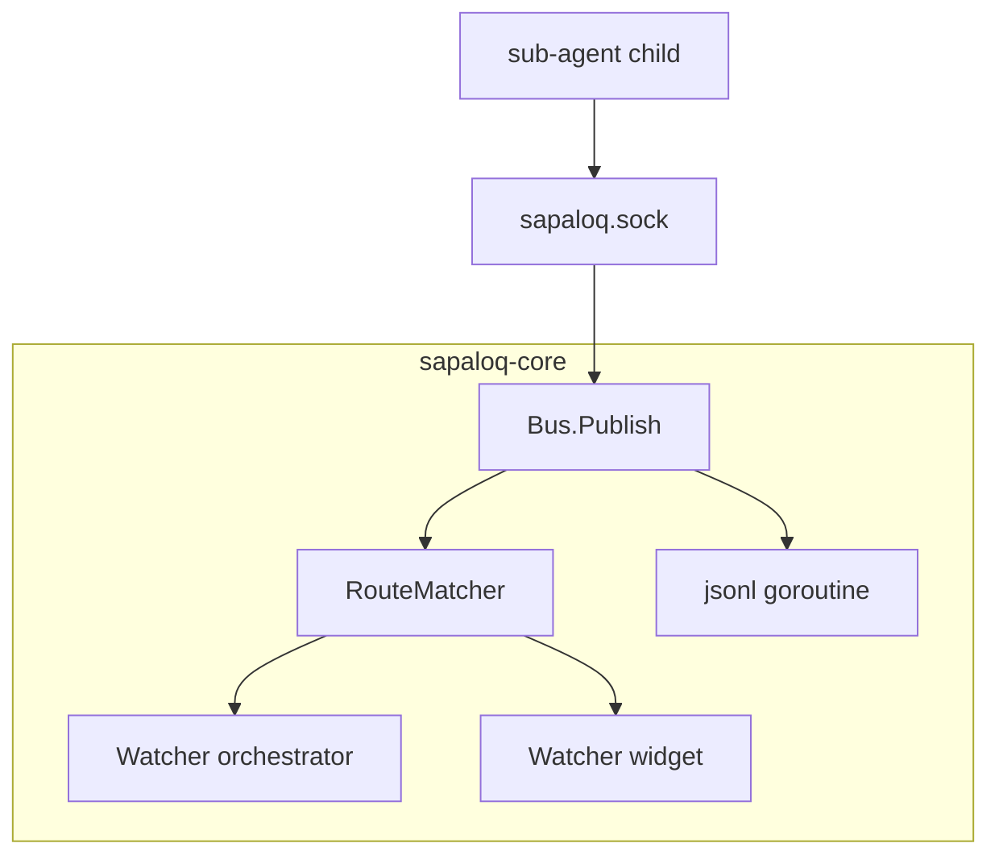


Built-in watchers at `main()`:


| ID           | Patterns                                 | Handler             |
| ------------ | ---------------------------------------- | ------------------- |
| orchestrator | `sapaloq.v1.subagent.*`, platform events | Wake loop           |
| widget       | `sapaloq.v1.subagent.progress.*`         | Ring HUD            |
| wal          | all                                      | Append events.jsonl |


### Unix socket

Path: `~/.config/sapaloq/run/sapaloq.sock`
Ops: `publish`, `watch`, `unwatch`, `event`, `ping`.

Orchestrator uses in-proc channel — no socket hop for local path.

### Bus config

```json
{
  "events": {
    "bus": {
      "enabled": true,
      "wakeViaBus": true,
      "socketPath": "~/.config/sapaloq/run/sapaloq.sock",
      "watcherBufferSize": 64,
      "topicPrefix": "sapaloq.v1",
      "replayOnBoot": true
    }
  }
}
```

Heartbeat 60s = **watchdog only** when `wakeViaBus: true`.

### Completion triggers

**Primary:** sub-agent terminal progress + `subagent.completed` on bus → wake **<5ms**.

**Fallback:** heartbeat stale detection (`staleAfterSec` default 120).

On completion: update task stack, decrement active count, optional notify, spawn memory-janitor async.

### Event watching (proactive)

Unified bus `events.jsonl`:


| source         | kind                                                    |
| -------------- | ------------------------------------------------------- |
| platform/gnome | notification.received, focus.changed                    |
| custom         | reminder.fired, email.received                          |
| internal       | subagent.completed, subagent.clarification, task.parked |


Watcher example:

```json
{
  "id": "gnome-notifications",
  "source": "platform.notification",
  "filters": { "apps": ["slack"], "ignoreSilent": true },
  "action": {
    "type": "orchestrator",
    "spawnSubAgent": "task-runner",
    "template": "Summarize notification: {{body}}"
  }
}
```

Dedicated **event-watcher** thread — orchestrator tidak block di D-Bus.

### systemd user unit

```ini
[Unit]
Description=SapaLOQ desktop companion
After=graphical-session.target

[Service]
ExecStart=%h/.local/bin/sapaloq-core
Restart=on-failure
Environment=SAPALOQ_HOME=%h/.config/sapaloq

[Install]
WantedBy=default.target
```

One service. One binary. One socket.

### Failure modes


| Failure            | Behavior                                        |
| ------------------ | ----------------------------------------------- |
| sapaloq-core crash | systemd restart; replay jsonl tail              |
| LLM API down       | Degrade chat; queue tasks; fallback local-llama |
| SQLite locked      | WAL mode + short retry                          |
| Slow watcher       | Drop + log                                      |


No "Redis failed so events broken" cascade.

### MVP tech stack


| Layer | Tech                                                                |
| ----- | ------------------------------------------------------------------- |
| Core  | Go 1.22+                                                            |
| UI    | Wails v2 + web (`sapaloq-widget`); Ubuntu 24.04: `-tags webkit2_41` |
| DB    | modernc.org/sqlite or mattn/go-sqlite3                              |
| IPC   | unix socket                                                         |
| GNOME | godbus                                                              |
| LLM   | HTTP client direct                                                  |


---

## Part XIV — Configuration Contract

### Philosophy

- **No settings UI** — all mutations via orchestrator chat + `/settings` sub-agent.
- **Schema-shaped** — [config.schema.json](../schema/config.schema.json) and
  the bootstrap example are parity-tested.
- **Agent-editable paths** — current `/settings patch` accepts only runtime
  fields that are actually consumed; roadmap-only paths are rejected.
- **Secrets never in config** — use `credentialsEnv` for LLM tokens.

Example bootstrap: [config.example.json](../config/config.example.json) (repo).

### config.json sections (overview)


| Section                                                          | Purpose                                                                                         |
| ---------------------------------------------------------------- | ----------------------------------------------------------------------------------------------- |
| `runtime`, `platform`                                            | Data directory + active env-driven desktop adapter                                              |
| `llmBridge`                                                      | Active provider registry; secrets via env only                                                   |
| `orchestrator`                                                   | Continuation, compaction, completion notification                                                |
| `skills`, `prompts`, `feedback`                                  | Bounded skill injection, replaceable role prompts, explicit negative guidance                    |
| `events.bus`                                                     | Socket path, JSONL WAL path, replay flag                                                         |
| `storage`, `subAgents`, `commands`                               | Scribe destinations, active role profiles, slash registry                                       |
| `vault`                                                          | Tool-call audit log rotation/retention (`maxLogBytes`, `keepRotatedFiles`) — see [RUNTIME.md](./RUNTIME.md#rotation--retention) |


Roadmap-only domains such as task-stack policy, context ingress, learning,
remote execution, event watchers, and `os.json` remain design contracts but are
intentionally absent from the first-boot example until their runtime consumers
exist.

### Key defaults (decisions already made)


| Key                                         | Default         | Decision                                             |
| ------------------------------------------- | --------------- | ---------------------------------------------------- |
| `runtime.singleBinary`                      | `true` (const)  | Always single binary                                 |
| `llmBridge.driver`                          | `cursor-bridge` | Primary brain; `local-llama` = offline fallback only |
| `orchestrator.spawnRouting.agentToolPolicy` | `"full"`        | Agent unrestricted post-plan                         |
| `orchestrator.spawnRouting.autoApprovePlan` | `false`         | User reviews plans                                   |
| Host command tool (`exec`) | available in **all** modes | Run any command anywhere (any path; optional `cwd`) — also reads any host file via `cat`/`sed`/`head`/`tail`/`rg`; shared dispatch in every mode — see `internal/core/orchestrator/tools_workspace.go` (`toolExec`) |
| File tools (`read_file`/`write_file`/`create_file`/`edit_file`/`delete_file`/`search`/`list_dir`/`glob`) | agent mutates; read/search/list everywhere | Flat, unrestricted CRUD — every `path` accepts absolute/`~`/CWD-relative. No workspace sandbox (a feature-not-security design) — see `internal/core/orchestrator/tools_workspace.go` |
| Local image vision (`read_image`) | available in **all** modes | Read a local image file (png/jpeg/gif/webp) into the model's vision — returns inline `data:` markdown that `extractImages` re-ingests into `bridge.Request.Images` (same channel as widget attachments); needs a vision-capable model |
| `nodes.allowSharedMemoryRemote`             | `false`         | Remote = context packet only                         |
| `events.bus.wakeViaBus`                     | `true`          | Bus primary wake                                     |
| `feedback.banditTunePrefetch`               | `true`          | Lightweight RL on rules                              |
| `context.prefetchConfidenceThreshold`       | `0.7`           | Skip explore at or above                             |
| `skills.maxLoadPerTurn`                     | `2`             | Anti skill-dump                                      |


### `/settings` allowed paths (default)

Hot-reloadable prefixes currently include continuation/compaction/completion,
sub-agent profiles, storage, and the two implemented feedback fields. Other
active startup config remains manually editable and takes effect on restart.
Nested leaf paths are validated; a patch to a roadmap-only field such as
`orchestrator.spawnRouting.autoApprovePlan` fails instead of reporting success.

**Not** in default allowed paths: raw credential injection, `llmBridge.credentialsEnv` value.

### Example settings mutation

```
User: /settings patch {"orchestrator":{"completion":{"notifyUserOnDone":true}}}
→ validate active nested path
→ reload through the full config loader
→ write config.json with updatedBy: sub-agent:settings
```

### platform section (via driver + os.json)

Current runtime adapter selection lives in `platform.*`:

```json
{
  "platform": {
    "adapter": "auto",
    "detectOrder": ["gnome", "freedesktop", "headless"],
    "allowFallback": true
  }
}
```

The fuller `driver.*` + generated `os.json` fingerprint/cache flow remains the
target in [DRIVER.md](./DRIVER.md); it is not implemented by the current direct
environment detector.

---

## Part XV — File System Layout

Complete target tree under `~/.config/sapaloq/`:

```text
~/.config/sapaloq/
├── config.json, os.json, cache/, run/sapaloq.sock
├── prompt/{core.md, roles/*, roles.d/, modes/, positive/, negative/, slices/}
├── skills/*.md
├── memory/{companion.db, files/{namespace}/, learning-queue.jsonl,
│          tasks/{stack.md,taskId/plan.md}, context-packets/,
│          progress/{subAgentId}.jsonl, control/, events.jsonl, archive/}
├── rules/{companion.md, automation.md}
├── mcp/servers.json          # Desktop MCP — NOT Cursor MCP
├── widget/{position.json, theme.json}
├── bridge/{cursor-bridge.schema.json, handoff/{uuid}.json}
└── nodes/{local-default.md, {name}.md}

~/Documents/sapaloq/{personal,hobby,work}/   # mode storage roots
~/.cursor/  ~/.local/share/cursor-agent/     # worker — ZERO overlap
```

### File ownership matrix


| Path             | Writer                                 | Reader                                  |
| ---------------- | -------------------------------------- | --------------------------------------- |
| config.json      | sub-agent:settings, validator          | orchestrator (RO), all roles (snapshot) |
| os.json          | sapaloq-core detect only               | agent read-only capability check        |
| companion.db     | memory-janitor, learning, scribe facts | intent-router, context-scaler           |
| progress/*.jsonl | sub-agents append                      | orchestrator tail, widget mirror        |
| events.jsonl     | bus WAL goroutine                      | replay on boot                          |
| roles.d/*        | learning-agent                         | context-scaler assemble                 |
| handoff/*.json   | orchestrator on handoff                | worker consumeOnce                      |


---

## Part XVI — Handoff Protocol

### Purpose

Companion **does not merge memory** to coding worker. Explicit packet bridges intent only.

### Handoff packet schema

Path: `~/.config/sapaloq/bridge/handoff/<uuid>.json`

```json
{
  "id": "550e8400-e29b-41d4-a716-446655440000",
  "createdAt": "2026-06-19T12:00:00Z",
  "prompt": "Refactor wec-customer auth middleware per plan-001 summary",
  "cwd": "/apps/workspace/wec-customer",
  "attachments": [],
  "planRef": {
    "planId": "plan-001",
    "summaryPath": "~/.config/sapaloq/memory/tasks/task-001/plan.md"
  },
  "mode": "work",
  "source": "sapaloq",
  "consumeOnce": true
}
```


| Field         | Required | Notes                                    |
| ------------- | -------- | ---------------------------------------- |
| `prompt`      | yes      | User intent distilled                    |
| `cwd`         | yes      | Worker project root                      |
| `consumeOnce` | yes      | Worker deletes/marks consumed after read |
| `planRef`     | optional | Link to SapaLOQ plan artifact            |
| `attachments` | optional | File paths user approved                 |


### Handoff flow

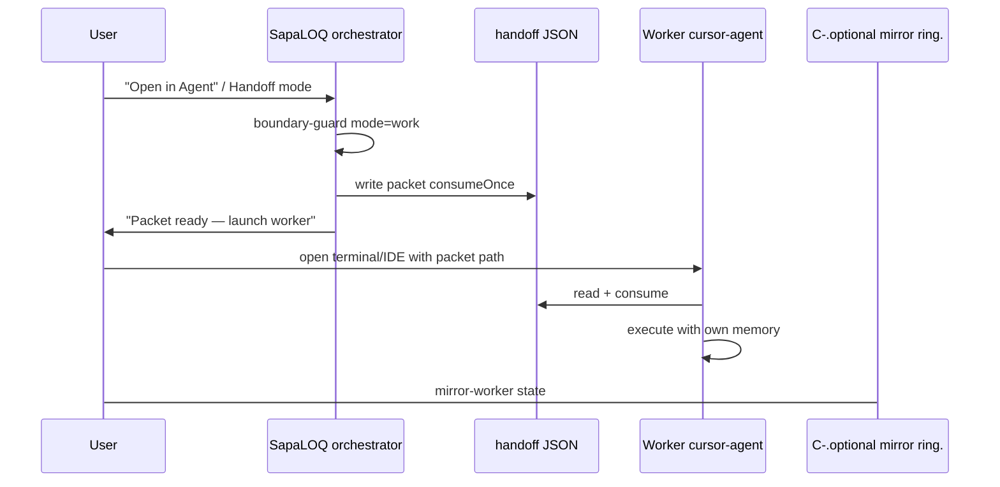


### Isolation guarantees

1. Worker **does not** read `companion.db`.
2. SapaLOQ **does not** ingest worker transcript into SQLite (mirror visual optional only).
3. MCP configs **separate** — `mcp/servers.json` vs Cursor MCP.
4. Handoff is **user-initiated** — never implicit on task-runner local exec.

### Worker mirror (optional, TBD)

Widget may listen worker stream-json for ring `mirror-worker` — **visual only**, no memory promotion.

Config decision open: listen stream-json vs purely idle ring.

---

## Part XVII — Limitations & Honest UX Contract

Full detail: [LIMITATIONS.md](./LIMITATIONS.md).


| Category                  | Hard limits (accept + honest UX)                                                                                   |
| ------------------------- | ------------------------------------------------------------------------------------------------------------------ |
| **Brain**                 | LLM latency 200ms–30s+; offline = no NL reasoning; rate limits/cost external                                       |
| **Downtime**              | Missed events while core off; boot delay 5–60s; sleep orphans tasks                                                |
| **Isolation (by design)** | Handoff ≠ shared memory; two products two truths; no settings UI recovery without doctor                           |
| **Platform**              | Incomplete notification bodies; Wayland HUD variance; portal prompts; Flatpak sandbox                              |
| **Architecture**          | Anti-poisoning vs fast task switch friction; orchestrator slim awareness; single binary SPOF; SQLite single-writer |
| **Remote nodes**          | No shared memory outer machines; network partition; stale context packet risk                                      |
| **Intelligence**          | Auto-learning can be wrong; web research untrusted; bandit cold start; parser/wire drift                           |


**SapaLOQ is:** local-first isolated companion; smart when brain available; proactive only while running.

**SapaLOQ is not:** always-aware when off; instant cloud replies; perfect implicit memory; IDE agent replacement.

---

## Part XVIII — Implementation Roadmap

### Milestone overview


| Phase  | Name                                      | Depends on |
| ------ | ----------------------------------------- | ---------- |
| **M0** | Architecture docs                         | — ✅        |
| **M1** | SQLite + nodes bootstrap                  | M0         |
| **M2** | Orchestrator task stack + progress        | M1         |
| **M3** | Completion + event bus + platform watcher | M2         |
| **M4** | Scribe + storage mapping                  | M2         |
| **M5** | Floating widget + ring mirror             | M3         |
| **M6** | context-scaler + memory-janitor           | M1, M2     |
| **M7** | Desktop tools + handoff                   | M3, M5     |
| **M8** | openai-compat + parsers                   | M2         |
| **M9** | cursor-bridge + coercion                  | M8         |


### Milestone deliverables & acceptance criteria


| Phase    | Deliverables                                                                            | Acceptance criteria (must pass)                                                         |
| -------- | --------------------------------------------------------------------------------------- | --------------------------------------------------------------------------------------- |
| **M0** ✅ | All modular docs + config.schema + BLUEPRINT                                            | Cross-linked docs; schema validates example; non-goals explicit                         |
| **M1**   | companion.db migrations; boot indexer; local-default node; doctor CLI                   | DB+indexes <3s; FTS hit on seed data; `catat`→path without LLM; migration idempotent    |
| **M2**   | Task stack; anti-poisoning; progress jsonl; spawn routing stub; control + clarification | Block 2nd task without park; snapshot <100ms; lifecycle commands work; spawnPath logged |
| **M3**   | internal/bus + WAL + sapaloq.sock; GNOME notify watch; reminder scheduler               | Bus wake <5ms; jsonl replay on boot; test toast→event; rate limit non-blocking          |
| **M4**   | scribe spawn; storage mapping; boundary-guard; natural-language notes; `/settings`      | Append correct notes; cross-mode blocked; settings patch + reject bad paths             |
| **M5**   | Wails FAB+popup HUD; ring states; chat IPC; progress mirror                             | M5a ✅ spike: transparent window, input shape, IPC ping; M5b wire real socket            |
| **M6**   | Full ingress pipeline; prompt assembler; janitor + learning hook                        | confidence≥0.7 skips explore; compaction reloads index; max 2 skills/spawn              |
| **M7**   | desktop_* tools; handoff packet; capability gating                                      | notify/screenshot work; handoff consumeOnce; no cursor-agent in main loop               |
| **M8**   | bridge.Registry; openai/claude parsers; openai-compat + local-llama                     | Stream to widget; canonical ToolCall; thinking stripped from memory; parser unit tests  |
| **M9**   | cursor/kimi parsers; cursor-bridge + coercion; RE test vectors                          | Pre-tag→ring not memory; Kimi inline when proto tools=0; no-9router-collapse passes     |


### Suggested vertical slice MVP (fastest user-visible path)

**Slice A (companion feel, minimal brain):** M1 → M2 → M4 → M5 with **cursor-bridge or stub LLM** — catat + widget + progress ring. M5a UI spike done.

**Slice B (proactive):** M3 added — notification → "mau rangkum?" prompt.

**Slice C (coding handoff):** M7 handoff only — no cursor-bridge required.

**Slice D (full brain Cursor):** M8 → M9 — last, highest complexity.

Recommended order for solo implementer: **M1 → M2 → M4 → M3 → M5 → M6 → M7 → M8 → M9**.

---

## Part XIX — Go Project Structure

Target repository layout: repo root (`github.com/jahrulnr/sapaloq`).

```text
sapaloq/                              # github.com/jahrulnr/sapaloq
├── cmd/sapaloq-core/                 # orchestrator + bus + IPC
├── cmd/sapaloq-widget/               # Wails thin client (M5a)
├── cmd/sapaloq-mock/                 # dev IPC fixture
├── internal/                         # shared packages (see Part XIX map)
├── docs/                             # architecture docs
├── schema/                           # config.schema.json, os.json.schema.json
├── config/                           # config.example.json
├── examples/nodes/                   # node comm-spec templates
├── migrations/
├── embed/
└── test/
```

### Package responsibility notes


| Package                 | Must not import                        |
| ----------------------- | -------------------------------------- |
| `core/orchestrator`     | GNOME, protobuf cursor                 |
| `drivers/gnome`         | orchestrator (only platform interface) |
| `bridges/cursor`        | drivers/gnome                          |
| `parse/thinking/cursor` | 9router code                           |
| `store`                 | UI, bridge wire details                |


Dependency rule: **core → store, bus, config, prompt** — never **drivers** directly; use `platform.Desktop` injected at main.

---

## Part XX — Testing & Quality Strategy


| Layer         | Scope                                               | Tools                      |
| ------------- | --------------------------------------------------- | -------------------------- |
| Unit          | Parsers, fingerprint, prefetch SQL, prompt assemble | Go test + fixtures         |
| Integration   | bus wake, task stack, scribe, settings patch        | tmp config dir             |
| Component     | GNOME D-Bus (tag `integration_gnome`)               | CI skip without session    |
| E2E           | Widget + orchestrator                               | Ubuntu 24.04 VM nightly    |
| RE regression | cursor thinking/tools vectors                       | cursor-bridge test-vectors |


**Critical M9 vectors:** `auto-thinking-only`, `auto-kimi-inline`, `thinking-leak-pre-tag`, `proto-tool-call`, `no-9router-collapse`.

**Quality gates:** schema validate on config write; `doctor` pre-release; remote spawn asserts `noMemoryBus`; anti-poisoning integration test; bus non-blocking test.

**Observability:** structured logs + prefetch_log — no external APM for MVP.

---

## Part XXI — Open Decisions & Risks


| #   | Open decision              | Options                                                                |
| --- | -------------------------- | ---------------------------------------------------------------------- |
| 1   | Default `llmBridge.driver` | **cursor-bridge** primary; local-llama fallback                        |
| 2   | Worker mirror              | stream-json vs visual idle                                             |
| 3   | systemd default            | auto-install vs manual                                                 |
| 4   | Local LLM offline scope    | how dumb is OK?                                                        |
| 5   | Widget toolkit             | ✅ **Wails v2** — see [UI-DECISION.md](./UI-DECISION.md); M5a validated |
| 6   | Product name               | Open — see [NAME-RECOMMENDATIONS.md](./NAME-RECOMMENDATIONS.md)        |


| Risk                              | Severity | Mitigation                                                                    |
| --------------------------------- | -------- | ----------------------------------------------------------------------------- |
| Cursor API drift                  | High     | L0 probes, schema sync, test vectors                                          |
| Wrong parser                      | High     | Per-driver parsers + integration tests                                        |
| Learning poisons index            | Medium   | structured extract, obsolete, 👎                                              |
| Layer Shell / compositor variance | Medium   | GNOME: GJS shim; KDE/Sway: gtk-layer-shell; GTK input shape for click-through |


**Scope creep traps (defer):** Redis, shared cursor memory, settings UI, 9router dep, full ToolCall parity, CRDT remote sync.

---

## Appendix A — Event topic catalog (`sapaloq.v1.*`)

Prefix: `config.events.bus.topicPrefix` default `**sapaloq.v1`**.


| Category         | Topics                                                                                                                     | Producer                            |
| ---------------- | -------------------------------------------------------------------------------------------------------------------------- | ----------------------------------- |
| **Sub-agent**    | `subagent.completed`, `subagent.clarification`, `subagent.progress.{id}`, `subagent.spawned`, `subagent.failed`            | sub-agent / orchestrator            |
| **Control**      | `orchestrator.control.{subAgentId}`, `orchestrator.task.parked`, `orchestrator.task.switched`, `orchestrator.mode.changed` | orchestrator                        |
| **Platform**     | `platform.notification`, `platform.focus.changed`, `platform.dnd.changed`                                                  | event-watcher / adapter             |
| **Legacy alias** | `gnome.notification`, `gnome.focus.changed`                                                                                | same handlers — deprecated names    |
| **Custom**       | `custom.reminder.fired`, `custom.email.received`, `custom.webhook`, `custom.file.changed`                                  | scheduler / watchers (later)        |
| **Learning**     | `learning.queue.item`, `memory.fact.promoted`, `config.changed`                                                            | learning-agent / janitor / settings |


jsonl WAL parallel `kind` examples:

```json
{ "v": 1, "kind": "subagent.completed", "subAgentId": "sub-abc", "status": "done", "ts": "ISO8601" }
{ "v": 1, "kind": "notification.received", "source": "platform", "app": "slack", "body": "..." }
```

Boot replay: tail WAL if `events.bus.replayOnBoot` — then live bus only. Detail: [EVENT-BUS.md](./EVENT-BUS.md).

---

## Appendix B — Progress event types

File: `~/.config/sapaloq/memory/progress/{subAgentId}.jsonl`

One JSON object per line. Common envelope:

```json
{
  "v": 1,
  "subAgentId": "sub-abc",
  "taskId": "task-001",
  "role": "scribe",
  "seq": 12,
  "ts": "2026-06-19T10:05:03Z",
  "type": "thinking",
  "status": "in_progress",
  "payload": {}
}
```

### `type` values


| type                     | payload shape                                        | Widget / orchestrator use      |
| ------------------------ | ---------------------------------------------------- | ------------------------------ |
| `thinking`               | `{ "text": "..." }`                                  | Ring deep think pulse          |
| `response`               | `{ "text": "...", "partial": true? }`                | Last assistant chunk in mirror |
| `tool_call`              | `{ "tool": "append_file", "args": {} }`              | Tool icon animation            |
| `tool_result`            | `{ "tool": "...", "ok": true, "summary": "..." }`    | Success/fail flash             |
| `todo`                   | `{ "items": [{ "id", "content", "status" }] }`       | Mini todo strip                |
| `status`                 | `{ "from", "to", "reason?", "summary?" }`            | Lifecycle transitions          |
| `clarification_request`  | `{ "question", "options?", "urgency", "context?" }`  | Interactive / needs-input      |
| `clarification_received` | `{ "answer", "source", "resolvedBy", "rationale?" }` | Resume sub-agent               |
| `control_ack`            | `{ "action", "ok", "detail?" }`                      | Pause/stop/resume ack          |
| `error`                  | `{ "message", "recoverable": bool }`                 | Error ring state               |


### `status` values


| status                   | Meaning                        |
| ------------------------ | ------------------------------ |
| `pending`                | Spawned, belum turn pertama    |
| `scheduled`              | delay_start — belum spawn      |
| `in_progress`            | Aktif                          |
| `awaiting_clarification` | Paused for Q&A                 |
| `paused`                 | Orchestrator paused            |
| `stopping`               | Cooperative shutdown in flight |
| `done`                   | Success terminal               |
| `failed`                 | Error terminal                 |
| `cancelled` / `stopped`  | User/orchestrator abort        |


### Terminal event requirement

Before exit, sub-agent **must** emit:

```json
{
  "type": "status",
  "status": "done",
  "payload": { "from": "in_progress", "to": "done", "summary": "Catatan ditambah ke personal-notes" }
}
```

Plus bus / WAL: `kind: subagent.completed`.

Config: `orchestrator.completion.requireTerminalEvent` default **true**.

### Orchestrator slim snapshot (derived, not stored in jsonl)

```json
{
  "subAgentId": "sub-abc",
  "taskId": "task-001",
  "role": "scribe",
  "status": "in_progress",
  "lastEvent": {
    "type": "tool_call",
    "ts": "2026-06-19T10:05:04Z",
    "payload": { "tool": "append_file", "args": { "path": ".../notes.md" } }
  },
  "todos": [{ "id": "1", "content": "Append note", "status": "in_progress" }],
  "seq": 12
}
```

---

## Appendix C — Modular documentation map


| File                                                                                                      | Role                   |
| --------------------------------------------------------------------------------------------------------- | ---------------------- |
| [BLUEPRINT.md](./BLUEPRINT.md)                                                                            | This unified proposal  |
| [README.md](./README.md) · [VISION.md](./VISION.md)                                                       | Entry + anchor         |
| [ORCHESTRATOR.md](./ORCHESTRATOR.md) · [CONTEXT-SOP.md](./CONTEXT-SOP.md)                                 | Runtime + memory       |
| [PROMPT-BUILDER-SOP.md](./PROMPT-BUILDER-SOP.md) · [FEEDBACK-SOP.md](./FEEDBACK-SOP.md)                   | Prompts + shaping      |
| [RUNTIME.md](./RUNTIME.md) · [EVENT-BUS.md](./EVENT-BUS.md)                                               | Single binary + bus    |
| [PLATFORM.md](./PLATFORM.md) · [DRIVER.md](./DRIVER.md)                                                   | Desktop + os.json      |
| [BRIDGE.md](./BRIDGE.md) · [RE-CURSOR-THINKING-TOOLS.md](./RE-CURSOR-THINKING-TOOLS.md)                   | LLM layer              |
| [NODES.md](./NODES.md) · [LIMITATIONS.md](./LIMITATIONS.md)                                               | Remote + honest limits |
| [config.schema.json](../schema/config.schema.json) · [config.example.json](../config/config.example.json) | Config contract        |


**External refs:** `cursor-agent-toolcall-spec.json`, `jahrulnr/cursor-bridge` monorepo (schema/probes), `automation-learning` skill pattern.

**Implementer reading order:** README → VISION → BLUEPRINT I–IV → ORCHESTRATOR + CONTEXT-SOP → config.schema → DRIVER/PLATFORM/RUNTIME/EVENT-BUS → BRIDGE + RE doc → NODES → LIMITATIONS.

---

## Document revision log


| Date       | Version        | Change                                                 |
| ---------- | -------------- | ------------------------------------------------------ |
| 2026-06-19 | 0.1.0-proposal | Initial unified BLUEPRINT synthesizing M0 modular docs |


---

## One-liner (closing)

> **SapaLOQ** — portable desktop companion (HUD + memory + platform adapter), GNOME first — orchestrator-only widget, sub-agent workers, SQLite anti-forget, single Go binary, optional handoff to coding agent. Config-by-agent. No Redis. No shared worker memory. No 9router dependency. Honest about limits.

*End of SapaLOQ Development Blueprint.*
