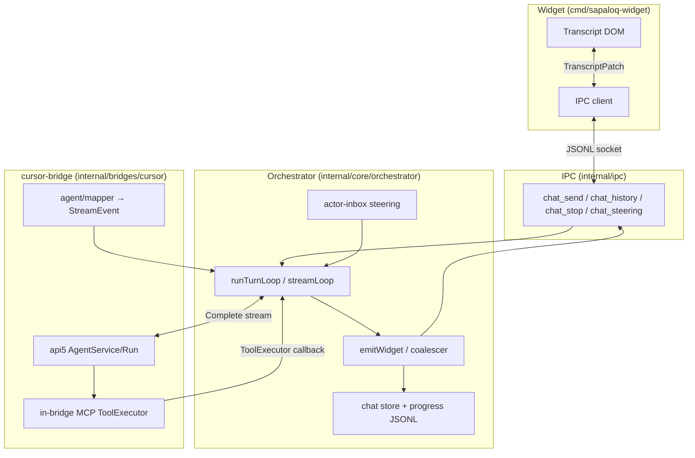

# SapaLOQ — Layer Boundaries & Simplification Sequence

> **Contract doc:** who owns what between cursor-bridge, orchestrator, IPC, and widget.
> Use this before adding guards at the turn loop or widget remount paths.
> Last updated: 2026-07-01 (event-driven turn loop; finished patch authority)

Related: [CURSOR_AGENT_CONTRACT.md](./CURSOR_AGENT_CONTRACT.md) · [BRIDGE.md](./BRIDGE.md) · [ORCHESTRATOR.md](./ORCHESTRATOR.md) · [UI-DECISION.md](./UI-DECISION.md) · [RUNTIME.md](./RUNTIME.md)

---

## Why this doc exists

Top-level orchestrator + widget were stable on provider-bridge + Opus-class models.
Regressions clustered after **cursor agent api5** (in-bridge MCP) and **multi-source
transcript** (SQLite turns + progress JSONL + live coalescer + DOM optimistic UI).

Patching symptoms at `conversation.go` or `chat-controller.ts` without fixing
ownership creates overlapping paths that are hard to trace. This doc defines
boundaries, markers, and the **order** to simplify before the next feature fix.

---

## Layers (north → south)



---

## Ownership table

| Concern | **Owner** | **Must not** | Canonical API / file |
|--------|-----------|--------------|----------------------|
| Provider wire (api5 frames, MCP exec) | **cursor-bridge** | Re-dispatch MCP in orchestrator `pendingTools` | `bridge_agent.go`, `wire/proto_agent_exec.go` |
| Stream → `bridge.StreamEvent` | **cursor-bridge** | Widget parsing raw provider bytes | `agent/mapper.go` |
| Turn loop, budgets, stop, compaction | **orchestrator** | Bridge deciding run end | `conversation.go`, `turnloop.go` |
| Tool dispatch (orchestrator tools) | **orchestrator** | Double-run `Source:cursor` tools | `tools_dispatch.go`, `streamLoop` cursor skip |
| In-bridge MCP persist (`cursor`/`codex`) | **orchestrator** | Widget or bridge writing `turns.json` | `in_bridge_persist.go`, `conversation.go` `EventToolUpdate` |
| Transcript **persistence + cold ordering** | **orchestrator** | Widget writing/reordering turns; grouping every role across a generation | `session_transcript.go`, `store/chat` |
| Transcript **live patch** | **orchestrator** `emitCoalescedTranscript` | Per-sink duplicate snapshot/delta logic | `widget_transcript_emit.go`, `chat.go`, `turnloop.go` |
| Transcript **render** | **widget** | Backend assuming DOM shape | `transcript-pane.ts`, `apply-transcript-delta.ts` |
| Foreground steering inbox | **orchestrator** | Steering as chat turn | `actor_events.go`, IPC `chat_steering` |
| Session workspace cwd | **orchestrator** | Widget persisting cwd without IPC | `workspace.go`, IPC `workspace_set` |
| Host context snapshot | **widget** collects, **orchestrator** normalizes + injects | Persisting host context to turns.json; using host_context to persist cwd (use `workspace_set`) | `internal/hostcontext`, `host_context.go`, IPC `chat_send.host_context` |
| Context usage pill | **orchestrator** `SessionContextLedger` (compute) + **widget** (display) | Two different token formulas; turns.json without orch JSONL | `session_context_ledger.go`, `connection.ts` |

---

## Known ambiguity hotspots (2026-06-28)

Map reported bugs to **boundary violations**, not random line bugs:

| Symptom | Likely boundary break | Layers involved |
|--------|------------------------|-----------------|
| Agent repeats same tool steps mid-run | In-bridge tools UI-only; `turns.json` / `cleanMessages` lag until Stop | orchestrator persist |
| Image/screenshot loop | In-bridge MCP progress refills orchestrator tool-less budget; identical-tool guard only sees `pendingTools` | bridge → orchestrator |
| Stop → empty tool bubbles | `patch.finished` remount then `scheduleRestoreChatHistory` overwrites with `ChatHistory` missing tools | orchestrator persist ↔ widget restore |
| Context 17k → 12k after restart | Live pill vs store recompute (`TokenEstimate` vs `estimateContentTokens` + overhead) | orchestrator store |
| Workspace back to `~/SapaLOQ` | UI shows `workspace_path` before `session_workspace`; session switch race | orchestrator + widget `runtime-status.ts` |

**Rule:** fix at the **owner** row in the table above, not by adding a third merge path.

**Persist contract (KISS):** append each turn row when its stream event completes
(wire order; `seq` reflects append time). Do not reorder at write. Model replay
uses `actorTurnsToMessages` + `replayContext`, which adapts storage to API order.
Terminal `EventTranscript{finished}` snapshot comes from `LiveSessionTranscript`
— same source as `ChatHistory` IPC; widget must not `restoreChatHistory` over it.

---

## Code markers

### Comment tag (always)

At boundary crossings, keep a single-line tag:

```go
// sapaloq:boundary <from>→<to> — <one-line contract>
```

```typescript
// sapaloq:boundary <from>→<to> — <one-line contract>
```

Layers: `cursor-bridge` | `orchestrator` | `ipc` | `widget` | `store`

### Trace flag (debug)

When `SAPALOQ_TRACE_BOUNDARIES=1`, crossings call `debug.TraceBoundary(from, to, event)`.
Grep markers: `sapaloq:boundary` or `TraceBoundary(`.

### Config flag (future, Phase 2)

Optional `orchestrator.traceBoundaries` in config — same as env, for doctor output.
Not wired until Phase 1 audit is done.

---

## Marker index (grep `sapaloq:boundary`)

| Marker location | Crossing |
|-----------------|----------|
| `internal/bridges/cursor/bridge_agent.go` | bridge → orchestrator stream |
| `internal/bridges/cursor/agent/mapper.go` | wire decode → StreamEvent |
| `internal/core/orchestrator/conversation.go` | streamLoop cursor/codex tool skip + ToolUpdate append |
| `internal/core/orchestrator/persist_append.go` | in-bridge ToolUpdate → turns.json + cleanMessages (wire order) |
| `internal/core/orchestrator/replay_context.go` | replayContext refresh for Complete() messages |
| `internal/core/orchestrator/stream_persist.go` | append-on-event persist handlers |
| `internal/core/orchestrator/chat.go` | emitWidget → IPC transcript patch |
| `internal/core/orchestrator/session_transcript.go` | store + JSONL → TranscriptEntry |
| `internal/core/orchestrator/actor_events.go` | widget steering → inbox |
| `internal/core/orchestrator/workspace.go` | IPC workspace_set → disk |
| `internal/ipc/server.go` | IPC op → orchestrator method |
| `cmd/sapaloq-widget/.../chat-controller.ts` | IPC patch → DOM |
| `cmd/sapaloq-widget/.../history.ts` | ChatHistory restore (danger: overwrites live) |

---

## Simplification sequence

Do **not** skip phases. Each phase ends with tests + manual row in the matrix.

### Phase 0 — Freeze & trace (1 session)

- [ ] Stop new top-level guards until Phase 2 done.
- [ ] Run with `SAPALOQ_TRACE_BOUNDARIES=1`; capture one full Ask + one cursor regression.
- [ ] Confirm marker index matches grep (no orphan merge paths).

**Exit:** trace log shows linear path: bridge events → streamLoop → emitWidget → widget patch.

### Phase 1 — Single transcript contract (orchestrator + widget)

**Goal:** one authoritative snapshot on `finished`; no restore-after-finished.

- [x] Widget: `task_update` / idle task patches use `patchForegroundTaskCards` (not `ChatHistory` restore).
- [x] Widget: removed `scheduleRestoreChatHistory` on Stop and on `patch.finished` (keep restore on session switch / delete branch / spoken-task completion for now).
- [ ] Orchestrator: `ChatHistory` == `SessionTranscript` + same coalesce as `emitWidget` done path.
- [x] Orchestrator: cold transcript preserves inference-round chronology; tool
  cards anchor to their persisted `[Called tools: …]` turn instead of raw
  pre-persistence event time.
- [ ] Delete or gate redundant DOM rebuild paths (`syncTranscript` vs `mountChatTranscript` on same generation).

**Exit:** Stop mid-run preserves tool bubbles without second IPC round-trip.

### Phase 2 — Cursor tool boundary (cursor-bridge + orchestrator)

**Goal:** orchestrator sees the same tool lifecycle for cursor MCP as for native tools.

Pick **one** design (document choice in `CURSOR_AGENT_CONTRACT.md`):

- **A (preferred):** bridge emits `tool_call` + `tool_update`; orchestrator loop guard / budgets apply to `Source:cursor`.
- **B:** bridge stays telemetry-only; orchestrator never refills tool-less budget on `dynamicProgress` from cursor alone.

Also: identical-tool / vision-loop guard must include in-bridge signatures.

- [x] In-bridge `EventToolUpdate` persists assistant + tool to `turns.json` and `cleanMessages` immediately (`in_bridge_persist.go`).
- [x] In-bridge `EventToolCall` counts toward budgets and identical-tool guard (no `pendingTools` dispatch).
- [ ] End-to-end regression: bangunsite agent-browser loop does not repeat steps after transport retry.

**Exit:** bangunsite regression cannot loop screenshot/read_image > N times without stop or explicit error.

### Phase 3 — Context & workspace clarity

- [ ] Context pill: one formula documented in `RUNTIME.md`; live == restart within overhead tolerance.
- [ ] Workspace: `RuntimeStatus.session_workspace` always from `actorCWD(session_id)`; widget never shows `workspace_path` when `session_id` set. **Partial (2026-06-29):** widget `SendMessage` calls `workspace_set` before send; cwd = `chat-{id}.json` only (no `_last.json`, no host_context persist).

**Exit:** restart manual matrix (below) green.

### Phase 4 — Prune dead paths

- [ ] Remove unused coalescer snapshot branches if delta-only is sufficient.
- [ ] Collapse steering to one mechanism (interrupt **or** safe-point queue, not both with deferred ack).
- [ ] Update `STATUS.md` status table; delete contradictory session bullets.

---

## Manual regression matrix (run after Phase 1–3)

| # | Action | Pass criteria |
|---|--------|----------------|
| 1 | Long Cursor Ask, Steer mid-stream | Model receives steering; bubble `is-applied` |
| 2 | Stop during tool run | Tool labels + results remain in transcript |
| 3 | Restart widget | Context pill within ~1 overhead block of pre-restart; tooltip shows active/compacted |
| 4 | Restart widget, same chat room | WORKSPACE shows persisted path (not install default) |
| 5 | bangunsite regression ask | No >5 identical vision probes; run ends or asks user |

---

## Anti-patterns (do not add)

1. **Third transcript merge** in widget “just to be safe”.
2. **Orchestrator dispatch** of tools already executed in `ToolExecutor` callback.
3. **Steering** that emits `steering applied` before the next `Complete()` sees the text.
4. **`_last.json` workspace bleed** across chat rooms without explicit user action.
5. **Provider-bridge fixes** copied into cursor path without updating `CURSOR_AGENT_CONTRACT.md`.

---

## Doc sync rule

When you change ownership at a boundary:

| You changed… | Update |
|--------------|--------|
| cursor api5 / MCP / mapper | `CURSOR_AGENT_CONTRACT.md`, this file marker row |
| emitWidget / coalescer / SessionTranscript | `UI-DECISION.md`, `RUNTIME.md`, this file Phase 1 |
| streamLoop tool skip / budgets | `ORCHESTRATOR.md`, Phase 2 |
| Widget patch / restore | `UI-DECISION.md`, Phase 1 |
| New marker site | This file marker index |

Always add a dated bullet to `STATUS.md` when a phase completes.
