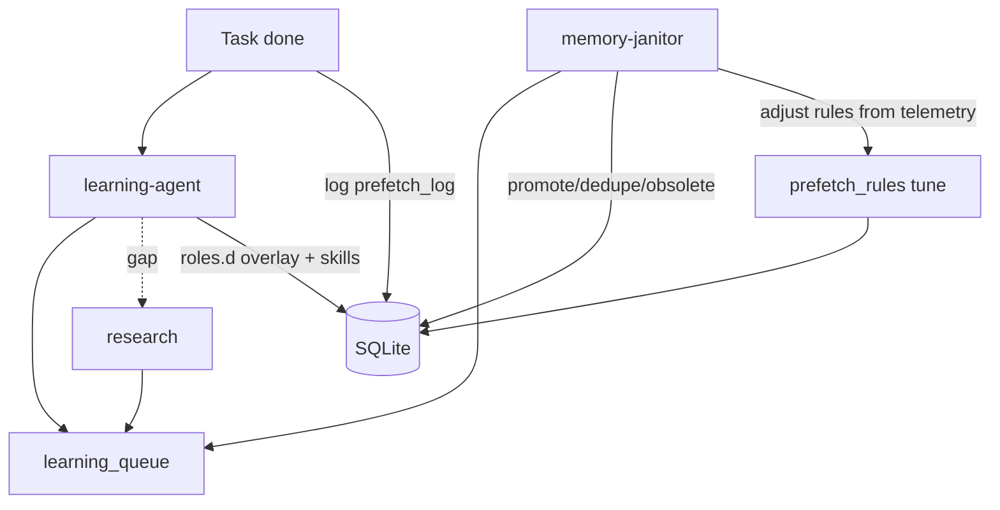

# SapaLOQ — Context SOP & Anti-Forget

> Anchor untuk **efficient context**, **dynamic system-prompt**, dan **auto-learning**.
> Adaptasi pola `automation-learning` untuk companion desktop — bukan repo coding.
> Last updated: 2026-06-22 (cancellation-safe streams and durable actor steering)

Related: [ORCHESTRATOR.md](./ORCHESTRATOR.md) · [VISION.md](./VISION.md) · [config.schema.json](../schema/config.schema.json)

---

## Masalah (Cursor-style failure modes)

Saat **compaction aktif** atau **low context**, agent cenderung:

| Symptom | Penyebab | Biaya |
|---------|----------|-------|
| **Lupa** | Skill/memory hilang dari prompt; hanya transcript tersisa | Ulangi kesalahan, salah mode/boundary |
| **Deep check** | Agent explore repo/fs/skills dari nol | Lambat, buang turn & token |
| **Over-read** | Baca 10+ file memory/rules sebelum aksi | Context penuh sebelum task mulai |
| **Static prompt** | System prompt monolit → tidak fit intent | Noise, skill salah load |
| **No index** | Hanya grep/file walk | Latency tinggi, tidak predictable |

SapaLOQ harus **prefetch context yang tepat dalam <2 detik** sebelum sub-agent jalan — bukan "cari dulu, baru kerja".

---

## Prinsip

1. **Index-first, search-second** — SQLite FTS + tag index → prefetch packet; grep/fs hanya kalau confidence rendah.
2. **Dynamic system-prompt** — assemble slice by intent/mode/task; never dump full skills catalog.
3. **SOP terstruktur** — system-prompt, skills, memory punya lifecycle seperti automation-learning (read → work → promote → obsolete).
4. **Anti-deep-check** — bounded exploration; default = skip explore jika prefetch hit.
5. **Auto-learning** — memory-janitor + learning queue; kinerja membaik over time.
6. **Compaction-safe** — durable state di index + files; transcript bukan source of truth.
7. **Feedback shaping** — reward/penalty → `do_not_repeat` + positive/negative slices ([FEEDBACK-SOP.md](./FEEDBACK-SOP.md)).
8. **Lifecycle certainty is durable** — task status comes from
   `state/tasks/<taskId>/status.json`; a missed live event or core restart must
   produce a visible snapshot/failure, never an indefinitely silent task.
9. **Cancellation is local and immediate** — Stop is observed by the
   orchestrator consumer directly; it must not wait for a provider stream to
   emit another event or close its channel. Failed retry attempts are cancelled
   and abandoned, not synchronously drained.
10. **Shared context is evented, not mutable** — Planner/Agent steering is
    queued in a durable target inbox and folded into that actor only at a safe
    point. A decision mediator receives a bounded snapshot; it never mutates the
    foreground UI orchestrator's live message slice.

---

## Context ingress pipeline (setiap user prompt)


### Fase 0 — Ingress (<100ms, no LLM if possible)

| Step | Actor | Output |
|------|-------|--------|
| Parse mode | orchestrator | `personal` / `hobby` / `work` / `auto` |
| Classify intent | intent-router (heuristic + optional tiny LLM) | `settings`, `catat`, `notify`, `task`, `chat`, … |
| Match task stack | orchestrator | `activeTaskId`, poison check |
| Lookup prefetch rules | SQLite `prefetch_rules` | kinds, skills, config keys |

### Fase 1 — Index prefetch (<500ms)

Query order (parallel where safe):

1. **Hot cache** — in-proc LRU inside sapaloq-core (`sync.Map` or bounded map)
2. **Facts by namespace** — mode `memoryNamespace`
3. **FTS5** — user prompt keywords + intent tags
4. **Skills index** — trigger match → max `skills.maxLoadPerTurn` skills
5. **Storage/apps** — intent → path id (already in config, indexed at boot)

Output: **prefetch packet** (bounded tokens):

```json
{
  "confidence": 0.82,
  "intent": "catat",
  "mode": "personal",
  "facts": [
    { "kind": "preference", "key": "notes_target", "value": "personal-notes" }
  ],
  "skills": [{ "id": "sapaloq-scribe", "path": "~/SapaLOQ/skills/scribe.md" }],
  "configKeys": ["/notifications/read", "/storage/intents"],
  "storagePathId": "personal-notes",
  "antiDeepCheck": true
}
```

`confidence >= threshold` → **skip filesystem exploration**.

### Fase 2 — Dynamic system-prompt assembly

**Dua jalur terpisah** — lihat [PROMPT-BUILDER-SOP.md](./PROMPT-BUILDER-SOP.md):

| Agent | Prompt source |
|-------|---------------|
| **orchestrator** | `core.md` + mode slice + task summary (slim) |
| **sub-agent (per role)** | `roles/{role}.md` + `roles.d/` overlay + skills + prefetch + feedback |

Layers for **orchestrator** (inject **only what applies**):

| Layer | Max tokens (guide) | When |
|-------|-------------------|------|
| **core** | ~400 | Always — orchestrator identity, anti-poisoning, mode |
| **mode** | ~200 | Always — boundary for active mode |
| **task** | ~300 | Active task on stack |
| **prefetch** | ~600 | Facts + config snapshot from index |
| **skill** | ~800 each | Max N skills from prefetch (default 2) |
| **ephemeral** | ~200 | Last progress snapshot if user asks status |

**Never inject:** full `config.json`, all skills, full memory DB, other tasks' history.

**Sub-agent spawn** must include assembled **`systemPrompt`** field — not reuse orchestrator prompt.

Template storage: `~/.config/sapaloq/prompt/roles/` + `roles.d/` + slices/ + SQLite `prompt_slices`.

### Fase 3 — Context packet → sub-agent

context-scaler merges prefetch + dynamic prompt slices → existing [context packet](./ORCHESTRATOR.md#context-packet-context-scaler-output).

---

## Anti-deep-check SOP

Default policy (`context.antiDeepCheck`):

| Condition | Action |
|-----------|--------|
| `prefetch.confidence >= 0.7` | **No explore** — act on prefetch |
| `0.4 <= confidence < 0.7` | Bounded: max 2 index queries + 1 file read |
| `confidence < 0.4` | Bounded explore: max 3 files, 2 tool calls, 30s budget |
| Compaction / low context flag | **Reload from index** — never replay full transcript |
| User repeat within 5 min | Serve **hot_cache** |
| Sub-agent requests more context | context-scaler approves + logs to learning_queue |

Orchestrator **reject** unbounded `grep`/`glob`/`read` from sub-agent unless context-scaler escalates.

Log every deep-check override → auto-learning adjusts prefetch rules.

---

## Memory kinds (companion-scoped)

Adaptasi dari automation-learning — namespace = mode (`personal`, `hobby`, `work`):

| kind | Purpose | Indexed fields |
|------|---------|----------------|
| `index` | Briefing per domain/user topic | purpose, entrypoints |
| `preference` | User likes/dislikes, defaults | key, value |
| `routine` | Recurring habits, schedules | schedule, action |
| `contact` | People/orgs (no secrets) | name, context |
| `touch-map` | Coupled apps/files/workflows | must_edit_together |
| `validation` | Known-good commands/paths | validation_command |
| `debug` | Failed attempts | do_not_repeat |
| `decision` | Durable choices | decision, reason |
| `obsolete` | Stale facts | obsolete_since, replacement |
| `maintenance` | Compaction/health notes | — |

File layout (optional mirror to SQLite):

```text
~/SapaLOQ/memory/files/
  {namespace}/
    YYYY-MM-DD-{slug}-{kind}.md
```

SQLite = **authoritative index**; markdown = human-readable source + agent append.

---

## SQLite index (primary store)

Path: `~/SapaLOQ/memory/companion.db` — **only** persistence engine. Hot cache = in-memory in same binary; optional `hot_cache` SQLite table for restart warm-up.

### Core tables

```sql
-- Durable facts (source of truth for retrieval)
CREATE TABLE facts (
  id TEXT PRIMARY KEY,
  namespace TEXT NOT NULL,          -- personal | hobby | work
  kind TEXT NOT NULL,
  key TEXT,
  value TEXT NOT NULL,
  tags TEXT,                        -- JSON array
  confidence REAL DEFAULT 1.0,
  source_file TEXT,
  updated_at TEXT NOT NULL,
  obsolete_at TEXT
);
CREATE INDEX idx_facts_ns_kind ON facts(namespace, kind);
CREATE VIRTUAL TABLE facts_fts USING fts5(
  value, tags, key, namespace, kind,
  content='facts', content_rowid='rowid'
);

-- FTS5 content table does NOT auto-sync — triggers required (M1 migration)
CREATE TRIGGER facts_fts_ai AFTER INSERT ON facts BEGIN
  INSERT INTO facts_fts(rowid, value, tags, key, namespace, kind)
  VALUES (new.rowid, new.value, new.tags, new.key, new.namespace, new.kind);
END;
CREATE TRIGGER facts_fts_ad AFTER DELETE ON facts BEGIN
  INSERT INTO facts_fts(facts_fts, rowid, value, tags, key, namespace, kind)
  VALUES ('delete', old.rowid, old.value, old.tags, old.key, old.namespace, old.kind);
END;
CREATE TRIGGER facts_fts_au AFTER UPDATE ON facts BEGIN
  INSERT INTO facts_fts(facts_fts, rowid, value, tags, key, namespace, kind)
  VALUES ('delete', old.rowid, old.value, old.tags, old.key, old.namespace, old.kind);
  INSERT INTO facts_fts(rowid, value, tags, key, namespace, kind)
  VALUES (new.rowid, new.value, new.tags, new.key, new.namespace, new.kind);
END;

-- Skills registry (like Cursor skills, sapaloq-local)
CREATE TABLE skills_index (
  id TEXT PRIMARY KEY,
  triggers TEXT NOT NULL,           -- JSON array
  path TEXT NOT NULL,
  priority INTEGER DEFAULT 0,
  max_tokens INTEGER DEFAULT 800,
  last_used_at TEXT
);

-- Intent → what to prefetch (auto-learned + manual)
CREATE TABLE prefetch_rules (
  id TEXT PRIMARY KEY,
  intent_pattern TEXT NOT NULL,     -- regex or exact
  namespace_scope TEXT DEFAULT 'any',
  fact_kinds TEXT,                  -- JSON array
  skill_ids TEXT,
  config_paths TEXT,
  hit_count INTEGER DEFAULT 0,
  success_rate REAL DEFAULT 0.0,
  updated_at TEXT
);

-- Dynamic prompt slices
CREATE TABLE prompt_slices (
  id TEXT PRIMARY KEY,
  role TEXT NOT NULL,               -- core | mode | task | skill | prefetch
  conditions TEXT,                  -- JSON: { intent, mode, minConfidence }
  template_path TEXT,
  token_budget INTEGER,
  priority INTEGER DEFAULT 0
);

-- Auto-learning queue (memory-janitor drains)
CREATE TABLE learning_queue (
  id INTEGER PRIMARY KEY AUTOINCREMENT,
  event_kind TEXT NOT NULL,         -- promote | dedupe | obsolete | rule_tune
  payload TEXT NOT NULL,
  created_at TEXT NOT NULL,
  processed_at TEXT
);

-- Session hot cache (also LRU in-process)
CREATE TABLE hot_cache (
  cache_key TEXT PRIMARY KEY,
  payload TEXT NOT NULL,
  expires_at TEXT NOT NULL
);

-- Prefetch telemetry (for auto-learning)
CREATE TABLE prefetch_log (
  id INTEGER PRIMARY KEY AUTOINCREMENT,
  prompt_hash TEXT,
  intent TEXT,
  confidence REAL,
  hit_facts INTEGER,
  deep_check_used INTEGER DEFAULT 0,
  task_success INTEGER,
  latency_ms INTEGER,
  ts TEXT
);

-- Sub-agent nodes (local + remote) — see NODES.md
CREATE TABLE nodes (
  name            TEXT PRIMARY KEY,
  role            TEXT NOT NULL,
  wrapper         TEXT NOT NULL,
  address         TEXT,
  communicate     TEXT NOT NULL,
  comm_spec_path  TEXT NOT NULL,
  enabled         INTEGER NOT NULL DEFAULT 1,
  priority        INTEGER NOT NULL DEFAULT 0,
  capabilities    TEXT,
  last_seen_at    TEXT,
  last_error      TEXT,
  created_at      TEXT NOT NULL,
  updated_at      TEXT NOT NULL
);
CREATE INDEX idx_nodes_role ON nodes(role, enabled, priority DESC);
```

### Boot index sync

On `sapaloq-core` start:

1. Load `config.json` → index `storage.paths`, `apps.entries`, `events.watchers`
2. Scan `~/SapaLOQ/skills/*.md` → `skills_index`
3. Scan `memory/files/**/*.md` → upsert `facts` + FTS
4. Load `prompt/slices/` → `prompt_slices`
5. Ensure `nodes` table has bootstrap row `local-default` — see [NODES.md](./NODES.md)

Incremental: inotify on skills + memory files.

### SQLite write concurrency (implementation note)

Single-writer queue in `sapaloq-core/internal/store/writer.go`:

```go
// All mutations: facts, skills_index, prefetch_rules, nodes, feedback_events
type WriteQueue struct {
    ch chan func(*sql.Tx) error  // buffer 256
}
// Readers: any goroutine (WAL mode). Writers: one goroutine drains ch.
```

See [LIMITATIONS.md](./LIMITATIONS.md) — mitigates partial; not infinite scale.

---

## Skills SOP (sapaloq-local)

Skills live in `~/SapaLOQ/skills/` — **not** `~/.cursor/skills-cursor/`.

### Skill file frontmatter

```yaml
---
id: sapaloq-scribe
triggers: [catat, notes, tulis, remember]
namespace: any
priority: 10
max_tokens: 600
load_policy: on-intent
---
# Scribe SOP
...
```

### Load policy

| Policy | When loaded |
|--------|-------------|
| `always-orchestrator` | Core orchestrator only (tiny) |
| `on-intent` | intent-router match |
| `on-mode` | Active mode match |
| `never-auto` | User explicit `/skill name` only |

Max `skills.maxLoadPerTurn` (default 2) — prevents skill dump on compaction.

### Create skill by agent

```
User: /settings buatin skill buat reminder obat
→ sub-agent:settings or dedicated skill-writer
→ write ~/SapaLOQ/skills/meds-reminder.md
→ upsert skills_index
→ optional: add prefetch_rule
```

Same SOP pattern as Cursor "create skill" — but sapaloq-owned path + index update **mandatory**.

---

## Prompt slices: source of truth

| Layer | Role |
|-------|------|
| **`prompt/slices/*.md`** (files) | **Editable source** — human/agent via `/settings` or learning-agent |
| **`prompt_slices` table** | **Index cache** — populated at boot + on file change (same pattern as `skills/` → `skills_index`) |

Boot sync (mandatory):

1. Scan `~/.config/sapaloq/prompt/slices/` + `modes/`
2. Upsert `prompt_slices` with `template_path`, `role`, `conditions` from frontmatter
3. Assembler **reads paths from index** — never walk filesystem per turn

Runtime: inotify on `prompt/` → re-index affected rows. **Do not** edit `prompt_slices` by hand except via indexer.

`roles/` and `roles.d/` are **not** in `prompt_slices` — loaded directly by role id at spawn (see [PROMPT-BUILDER-SOP.md](./PROMPT-BUILDER-SOP.md)).

---

## Dynamic system-prompt assembly (detail)

```text
~/.config/sapaloq/prompt/
  core.md                 # Always — orchestrator SOP
  modes/
    personal.md
    hobby.md
    work.md
  slices/                 # Conditional templates
```

Assembler pseudocode:

```python
def assemble_prompt(intent, mode, prefetch, task):
    slices = []
    slices += load_slice("core", always=True)
    slices += load_slice(f"modes/{mode}")
    if task:
        slices += render_task_slice(task, budget=300)
    if prefetch.confidence >= 0.7:
        slices += render_prefetch(prefetch, budget=600)
    for skill in prefetch.skills[:max_skills]:
        slices += load_skill_truncated(skill, budget=skill.max_tokens)
    return clamp_tokens(slices, max_total=config.context.maxPromptTokens)
```

On **compaction signal** (context >80% or explicit):

1. Drop ephemeral + old task slices
2. Re-query index for active task only
3. Re-assemble — **do not** re-read all skills

---

## Auto-learning loop

Post-task **learning-agent** (automation-learning SapaLOQ) builds prompts & skills — see [PROMPT-BUILDER-SOP.md](./PROMPT-BUILDER-SOP.md). Optional **research** sub-agent fetches web best practices async.



### Triggers (learning-agent — async after task done)

- Task completed success + `learning.buildOnSuccess` → extract patterns, maybe skill
- User 👎 or correction → always → overlay + do_not_repeat
- Novel intent / no skill match → queue **research** if enabled
- Same intent failed ≥2 → research + negative slice
- Routine low-value success (e.g. catat) → skip if below `learning.minRewardToBuild`

### Promotion (after meaningful interaction)

Extract to `learning_queue`:

```json
{
  "event_kind": "promote",
  "payload": {
    "namespace": "personal",
    "kind": "preference",
    "key": "default_notes",
    "value": "personal-notes",
    "source": "task-042"
  }
}
```

memory-janitor writes fact + FTS + optional markdown mirror.

---

## Sub-agent roles (extended)

| Role | Context SOP duty |
|------|------------------|
| **intent-router** | Classify intent; query prefetch_rules; set confidence |
| **context-scaler** | Assemble role systemPrompt + context packet; anti-deep-check |
| **orchestrator** | Trigger ingress; spawn with role prompt; never hold full memory |
| **learning-agent** | Post-task: prompt overlay + skills builder; queue research |
| **research** | Web best practice → facts + skill draft (async) |
| **memory-janitor** | Drain queue; compact overlays; index sync; rule tuning |

Add `intent-router` as lightweight step — can be same process as orchestrator pre-hook.

---

## Config keys

See `config.context`, `config.memory.index`, `config.skills`, `config.learning` in [config.schema.json](../schema/config.schema.json).

---

## Efficient context checklist (agent SOP)

Before any sub-agent spawn:

1. Run ingress pipeline — **do not** manual grep skills/memory first.
2. Check prefetch confidence — if high, **forbid** deep check.
3. Load max 2 skills from index match.
4. Assemble dynamic prompt — log token budget used.
5. Pass context packet only — not full history.

After task:

1. Queue durable facts to learning_queue.
2. Log prefetch telemetry.
3. If deep_check was used, note why for rule tuning.

On compaction / session resume:

1. Read active task from `tasks/` stack.
2. Re-prefetch from SQLite — **not** transcript replay.
3. Re-assemble dynamic prompt.

---

## Implementation order

| Step | Deliverable |
|------|-------------|
| 1 | `companion.db` schema + boot indexer |
| 2 | intent-router + prefetch_rules seed |
| 3 | dynamic prompt assembler + slices |
| 4 | context ingress hook in orchestrator |
| 5 | anti-deep-check enforcement in context-scaler |
| 6 | learning_queue + memory-janitor drain |
| 7 | prefetch telemetry + auto rule tuning |
| 8 | Skills directory + index sync |

---

## Related patterns (external)

- **automation-learning** (`~/.agents/skills/automation-learning/`) — repo/project memory SOP; SapaLOQ adapts same *kinds* and *read-before-work* for desktop companion namespaces.
- **ORCHESTRATOR.md** — context packet, task stack, anti-poisoning.
- Worker handoff — coding memory stays in worker; SapaLOQ index holds **companion-relevant** facts only.
