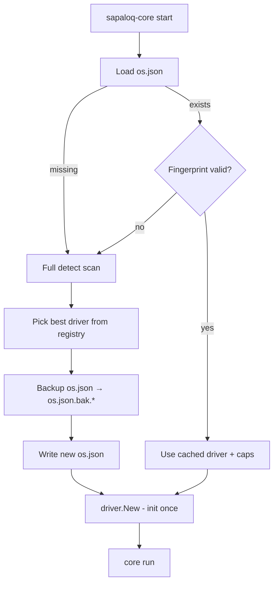

# SapaLOQ - Driver Architecture (Go)

> **Modular drivers** - detect OS/distro/DE once, cache **`os.json`**, load matching **platform driver**.
> LLM **bridge drivers** (cursor-bridge, openai-compat, …) = keluarga terpisah - see [BRIDGE.md](./BRIDGE.md).
> Last updated: 2026-06-22 (runtime OS/cache paths moved to ~/SapaLOQ)

Related: [PLATFORM.md](./PLATFORM.md) · [BRIDGE.md](./BRIDGE.md) · [RUNTIME.md](./RUNTIME.md) · [os.json.schema.json](./os.json.schema.json)

---

## Dua keluarga driver

| Family | Registry | Selection | Doc |
|--------|----------|-----------|-----|
| **Platform** (this file) | `internal/driver/` | `os.json` + detect | DRIVER.md |
| **LLM bridge** | `internal/bridge/` | `config.json` → `llmBridge.driver` | [BRIDGE.md](./BRIDGE.md) |

Platform driver ≠ brain driver. **cursor-bridge** is an LLM bridge driver, not a GNOME driver.

---

## Stack (platform)

```
sapaloq-core (single Go binary)
├── core/           orchestrator, bus, JSON store - no OS imports
├── detect/         OS + distro + DE probe
├── driver/         platform registry, os.json cache, fingerprint
├── drivers/        gnome, kde, freedesktop, windows, headless
├── bridge/         LLM bridge registry - see BRIDGE.md
└── bridges/        cursor-bridge, openai-compat, claude-compat, llama-cpp, …
```

**Platform driver** = implementasi `platform.Desktop` untuk kombinasi OS/DE tertentu.

---

## Boot flow



### Fast path (<10ms)

1. Read `~/SapaLOQ/os.json`
2. Compare `fingerprint` dengan cheap probe (env + 2–3 file stats)
3. Match → load `selectedDriver` + `capabilities` - **no full scan**

### Slow path (distro change, first run, corrupt cache)

1. Full probe: `/etc/os-release`, `$XDG_CURRENT_DESKTOP`, session type, D-Bus names
2. Score each registered driver → pick highest
3. Backup old `os.json` → `cache/os.json.bak.<timestamp>`
4. Write new `os.json`
5. Init driver

User pindah distro (Ubuntu → Fedora KDE) → fingerprint mismatch → auto rescan + backup.

---

## `os.json` (generated - not hand-edited)

Path: `~/SapaLOQ/os.json`
Schema: [os.json.schema.json](./os.json.schema.json)

```json
{
  "schemaVersion": "1.0.0",
  "generatedAt": "2026-06-19T10:00:00Z",
  "fingerprint": "sha256:abc123...",
  "probe": {
    "goos": "linux",
    "goarch": "amd64",
    "distroId": "ubuntu",
    "distroVersion": "24.04",
    "prettyName": "Ubuntu 24.04 LTS",
    "desktop": "GNOME",
    "sessionType": "wayland",
    "xdgCurrentDesktop": "ubuntu:GNOME"
  },
  "selectedDriver": "gnome",
  "driverVersion": "1",
  "capabilities": [
    "notify",
    "notify.watch",
    "screenshot",
    "window.list",
    "window.focus",
    "clipboard",
    "dnd"
  ],
  "paths": {
    "dataDir": "/home/user/SapaLOQ",
    "runtimeDir": "/run/user/1000"
  }
}
```

**Agent reads** `os.json` for capability checks - **does not** rescan OS.

---

## Fingerprint

Hash dari sinyal stabil (bukan seluruh filesystem):

```go
type FingerprintInput struct {
    Goos              string
    DistroID          string
    DistroVersionID   string
    XDGCurrentDesktop string
    SessionType       string // wayland|x11|...
    GnomeShellVersion string // optional, if gnome
}
```

Cheap validate on boot:

```go
func QuickValidate(cached OSCache) bool {
    if os.Getenv("XDG_CURRENT_DESKTOP") != cached.Probe.XdgCurrentDesktop {
        return false
    }
    if readDistroID() != cached.Probe.DistroID {
        return false
    }
    // optional: gnome-shell --version prefix
    return true
}
```

Mismatch → full scan, backup, rewrite.

---

## Driver registry (modular)

```go
// internal/driver/registry.go

type DriverFactory interface {
    ID() string
    Match(probe ProbeResult) (score int) // 0 = no match
    New(ctx context.Context, cfg Config) (platform.Desktop, error)
}

func Register(f DriverFactory)  // init() per driver package
func Select(probe ProbeResult, order []string) (DriverFactory, error)
```

### Driver packages

```text
internal/drivers/
  gnome/       linux + GNOME/Cinnamon-ish
  kde/         linux + KDE Plasma
  freedesktop/ linux fallback (D-Bus notify, portal)
  windows/     GOOS=windows
  headless/    no DE - notify off, file only
```

Each driver: `_ "sapaloq/internal/drivers/gnome"` in `main.go` for registration.

### Scoring example

| Probe | gnome | kde | freedesktop |
|-------|-------|-----|-------------|
| Ubuntu GNOME Wayland | 100 | 0 | 20 |
| Kubuntu Plasma | 0 | 100 | 20 |
| Debian X11 minimal | 30 | 0 | 80 |

Config override: `driver.override: gnome` skips scoring.

---

## Config vs os.json

| File | Who writes | Purpose |
|------|------------|---------|
| `config.json` | User/agent via `/settings` | Preferences, orchestrator, modes |
| `os.json` | **sapaloq-core detect** | Cached OS/DE + driver selection |

**Never** merge - agent tidak edit `os.json` unless `/settings force-rescan` (optional command).

---

## `config.json` driver section

```json
{
  "driver": {
    "mode": "auto",
    "override": null,
    "osJsonPath": "~/SapaLOQ/os.json",
    "backupDir": "~/SapaLOQ/cache",
    "rescanOnFingerprintMismatch": true,
    "detectOrder": ["gnome", "kde", "freedesktop", "windows", "headless"]
  }
}
```

| Key | Behavior |
|-----|----------|
| `mode: auto` | detect + os.json cache |
| `override: kde` | force driver; still refresh os.json on mismatch |
| `rescanOnFingerprintMismatch` | backup + full scan |

---

## Project layout

```text
sapaloq-core/
  cmd/sapaloq-core/main.go
  internal/
    core/              orchestrator, bus, JSON store
    detect/
      probe.go         full scan
      fingerprint.go   hash + quick validate
      osrelease.go     /etc/os-release parser
    driver/
      registry.go
      oscache.go       read/write/backup os.json
    platform/
      desktop.go       Desktop interface
    drivers/
      gnome/driver.go
      kde/driver.go
      ...
```

---

## CLI helpers

```bash
sapaloq-core detect          # print probe + selected driver; write os.json
sapaloq-core detect --force  # ignore cache, rescan, backup
sapaloq-core doctor          # validate os.json + config + caps
```

---

## Implementation order

| Step | Deliverable |
|------|-------------|
| 1 | `detect` probe + fingerprint |
| 2 | `os.json` read/write/backup |
| 3 | `driver.Registry` + `drivers/headless` |
| 4 | `drivers/gnome` MVP |
| 5 | Boot: cache fast path in `main` |
| 6 | `drivers/kde`, `freedesktop`, `windows` |

---

## Non-goals

- Plugin `.so` at runtime (compile-time registry cukup untuk MVP)
- Rescan every boot (defeats os.json purpose)
- Agent-editable os.json as normal path
