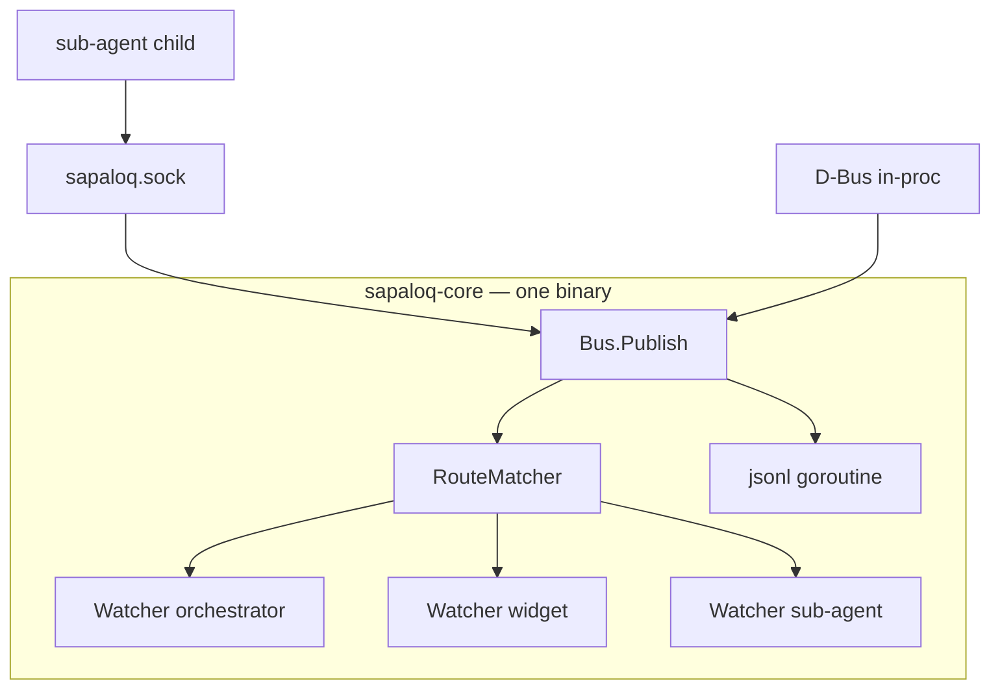

# SapaLOQ — Event Bus (in-process)

> **Internal pub/sub** inside `sapaloq-core` — goroutine + channel + route watcher.
> Bukan service terpisah. Bukan Redis / Rabbit / MQTT.
> Last updated: 2026-06-21

Related: [RUNTIME.md](./RUNTIME.md) · [ORCHESTRATOR.md](./ORCHESTRATOR.md)

---

## Prinsip

Event wake = **fungsi dalam binary yang sama**:

1. **Route table** — topic pattern → watchers
2. **Publish** — fan-out ke `chan Envelope` (<1ms)
3. **Unix socket** — optional IPC ke sub-agent process; tetap ke **same** binary
4. **jsonl WAL** — goroutine append (persist, replay on boot)

```
❌ External broker, Redis, Rabbit, MQTT
✅ internal/bus + route.Watcher
```

---

## Arsitektur



---

## Route watcher (Go sketch)

```go
// sapaloq-core/internal/bus/bus.go

type Bus struct {
    mu       sync.RWMutex
    watchers []*Watcher
    seq      atomic.Uint64
    walPath  string
    hotCache sync.Map          // optional session dedupe
}

func (b *Bus) Watch(id string, patterns []string, buf int) *Watcher
func (b *Bus) Publish(topic, producer string, payload any) (Envelope, error)
```

Publish never blocks on slow consumer — drop + log.

---

## Built-in watchers (registered at `main()`)

| ID | Patterns | Handler |
|----|----------|---------|
| `orchestrator` | `sapaloq.v1.subagent.*`, `sapaloq.v1.gnome.*`, … | Wake loop |
| `widget` | `sapaloq.v1.subagent.progress.*` | Ring HUD |
| `wal` | all | Append `events.jsonl` |

---

## Unix socket (same binary)

```text
~/.config/sapaloq/run/sapaloq.sock
```

Ops: `publish`, `watch`, `unwatch`, `event`, `ping`.

Orchestrator uses in-proc channel — **no socket hop**.

The widget `watch` stream is live-first but not live-only. After the subscribe
ack, the IPC server rehydrates recent `EventTaskUpdate` snapshots from
`memory/tasks/*/status.json`, then streams bus events. This closes the race
where task completion happened before the widget connected or while it was
reconnecting. Provider-level `EventDone` is not a task lifecycle event.

On a **terminal** task transition (done/failed/awaiting/stopped) the
orchestrator does two things: it publishes the `task_update` card event **and**
`speakTaskCompletion` (`completion.go`) injects a durable assistant turn into the
task's session and republishes it as a `response_delta` on
`sapaloq.v1.chat.response`. That republish is the "speak" trigger that closes the
event-driven loop — a completion arriving after `sapaloq_wait` has already
returned is still surfaced in chat, not just as a silently-updated card. It is
idempotent per task id and gated by `completion.speakOnTerminal`.

---

## Topics

Prefix `sapaloq.v1` — see prior catalog (subagent.completed, orchestrator.control.{id}, gnome.notification, …).

---

## Config

```json
{
  "events": {
    "bus": {
      "enabled": true,
      "wakeViaBus": true,
      "socketPath": "~/.config/sapaloq/run/sapaloq.sock",
      "watcherBufferSize": 64
    }
  }
}
```

Heartbeat 60s = watchdog only when `wakeViaBus: true`.

---

## Non-goals

- Separate broker process or container
- Redis / MQTT / Rabbit as dependency
- Cross-machine bus (use file export later if needed)

See [RUNTIME.md](./RUNTIME.md) for full single-binary stack.
