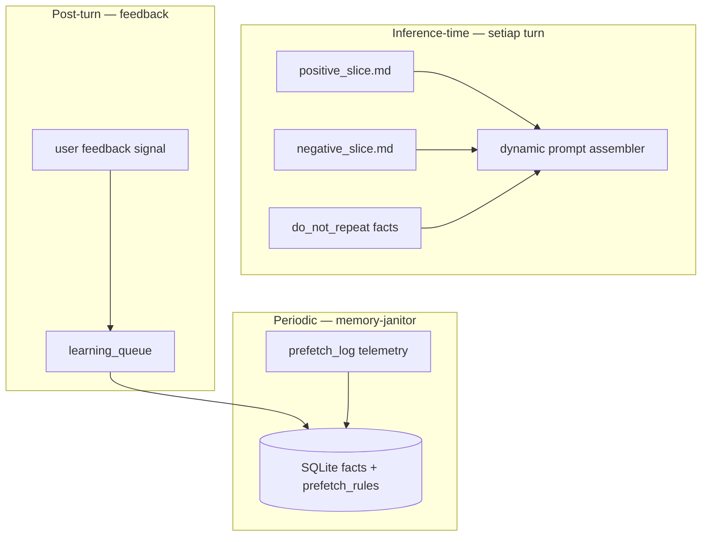

# SapaLOQ — Feedback, Penalty & Behavioral Shaping

> Apakah RL masuk akal? **Full RL on model weights: tidak (MVP).**
> **RL-inspired feedback loop + positive/negative behavioral slices: ya — ini yang kita pakai.**
> Last updated: 2026-06-19

Related: [CONTEXT-SOP.md](./CONTEXT-SOP.md) · [ORCHESTRATOR.md](./ORCHESTRATOR.md)

---

## Verdict singkat

| Approach | Masuk akal? | Why |
|----------|-------------|-----|
| **PPO / RLHF fine-tune** model companion | ❌ MVP | Mahal, butuh infra training, data volume, drift |
| **Reward signal + index update** | ✅ Core | Cepat, lokal, auditable, fits SQLite |
| **Positive/negative prompt slices** | ✅ Core | Analog t2i negative prompt — **behavioral**, bukan weight |
| **Good/bad exemplars** (Codex-style) | ✅ Core | Proven di coding agents; cheap at inference |
| **Contextual bandit** on prefetch rules | ✅ Later | Lightweight "RL" tanpa sentuh weights |
| **Explicit user penalty** (👎, "salah") | ✅ Core | Ground truth preference |

**Analogi media generation:**

```
t2i:  prompt + negative_prompt  →  steer diffusion
SapaLOQ:  positive_slice + negative_slice + prefetched do_not_repeat  →  steer LLM behavior
```

Bukan train ulang model — **conditioning** at prompt-time + **durable memory** of what user hates.

---

## Tiga layer (stacked)



1. **Prompt-time shaping** — positive/negative exemplars + `do_not_repeat` (immediate)
2. **Episode feedback** — user 👍/👎, "salah", correction → reward/penalty event
3. **Rule tuning** — contextual bandit on prefetch_rules (slow, optional)

---

## Reward / penalty signals

### Explicit (user)

| Signal | reward | Example |
|--------|--------|---------|
| 👍 / "mantap" / "thanks" | +1 | Task done right |
| 👎 / "salah" / "bukan itu" | -1 | Wrong mode, wrong file |
| Correction text | -1 + **structured fix** | "Bukan work notes, personal" |
| Ignore / no reply 5min after bad act | -0.3 weak | Implicit dissatisfaction |
| Re-ask same thing | -0.5 | Agent "lupa" / failed |

### Implicit (telemetry)

| Signal | reward | Use |
|--------|--------|-----|
| Task success + no deep_check | +0.5 | Reinforce prefetch rule |
| deep_check override + success | +0.2 | Rule needs loosening |
| deep_check + user 👎 | -0.8 | Rule wrong |
| Wrong namespace write blocked | -1 | boundary-guard training data |
| User switches task mid-flow (poisoning) | 0 | Not agent fault |

Store in `feedback_events` table + mirror hot cases to `learning_queue`.

---

## Codex-style good/bad exemplars

Codex tidak pakai RL — pakai **paired examples** in system prompt:

- **High-quality plans** vs **Low-quality plans**
- **Good preambles** vs (implicit) verbose/wrong patterns
- **Do / Don't** sections

SapaLOQ adapts untuk companion:

```text
~/.config/sapaloq/prompt/
  positive/
    delegate-fast.md      # Good: spawn scribe, reply immediately
    mode-boundary.md      # Good: ask before cross-mode
    settings-patch.md     # Good: /settings → config.json only
  negative/
    no-deep-check.md      # Bad: grep 10 files before catat
    no-blocking.md        # Bad: orchestrator awaits sub-agent
    no-cross-mode.md      # Bad: write work file in personal mode
```

### Dynamic injection

context-scaler loads slices by **intent + recent penalties**:

```json
{
  "positiveSlices": ["delegate-fast", "mode-boundary"],
  "negativeSlices": ["no-deep-check"],
  "doNotRepeat": [
    "2026-06-18: wrote to work-inbox while mode=personal — user corrected"
  ]
}
```

Max 1 positive + 1 negative exemplar block per turn (token budget) — like t2i keeping negative prompt short.

### Example pair (companion /settings)

**Good ✅**

```
User: matiin read notification
Orchestrator: spawn settings → patch notifications.read=false → confirm in 1 sentence
```

**Bad ❌**

```
User: matiin read notification
Orchestrator: "Let me search your config..." → reads 5 files → asks clarifying questions → still not patched
```

Agent-created skills can append good/bad pairs when user corrects — same SOP as automation-learning `do_not_repeat`.

---

## Penalty → durable memory (bukan weight update)

When user penalizes:

```json
{
  "event_kind": "penalty",
  "payload": {
    "namespace": "personal",
    "kind": "debug",
    "do_not_repeat": "spawn task-runner for simple catat — use scribe",
    "context": { "intent": "catat", "subAgent": "task-runner", "taskId": "task-019" },
    "reward": -1,
    "userQuote": "keknya kepanjangan, catat aja langsung"
  }
}
```

memory-janitor:

1. Upsert `facts` with `kind=debug`, tag `do_not_repeat`
2. Lower `prefetch_rules.success_rate` for matching intent→subAgent mapping
3. Add negative slice trigger if pattern repeats ≥2 times
4. Optional: bump `confidence` threshold for that intent (be more careful)

**Positive feedback** symmetrically promotes good patterns to `preference` or strengthens prefetch_rule.

---

## "RL" yang masuk akal: contextual bandit (optional)

Full RL: update policy π(a|s). Kita **tidak** update LLM weights.

**Contextual bandit** on discrete actions — cukup untuk SapaLOQ:

- **State:** intent, mode, confidence, time of day
- **Actions:** which sub-agent, which prefetch_rule, which skill pair
- **Reward:** user feedback + task success + latency penalty

Algorithm: **ε-greedy** or ** Thompson sampling** on `prefetch_rules.success_rate` — simple, no GPU.

```sql
-- Already in prefetch_rules
hit_count, success_rate  -- update after each episode:
-- success_rate = (success_rate * hit_count + reward) / (hit_count + 1)
```

This is "RL-flavored" without training infrastructure.

---

## Anti-patterns (jangan)

| Don't | Why |
|-------|-----|
| Fine-tune local LLM on every 👎 | Overfit, forget, expensive |
| Huge negative prompt dump | Context bloat — same failure as skill dump |
| Silent penalty without user confirm on harsh -1 | False positives poison index |
| Penalize orchestrator for user task switch | Wrong attribution |
| Store raw angry transcript as fact | Noise; extract structured `do_not_repeat` only |

---

## Config hooks

See `config.feedback` in [config.schema.json](../schema/config.schema.json):

- `explicitSignalsEnabled` — 👍/👎 in widget
- `implicitSignalsEnabled` — telemetry rewards
- `maxNegativeSlicesPerTurn` — default 1
- `maxPositiveSlicesPerTurn` — default 1
- `banditTunePrefetch` — contextual bandit on/off
- `penaltyRequiresStructuredExtract` — janitor must parse fix, not raw rant

---

## Integration checklist

**On user 👎:**

1. Log `feedback_events` (reward, taskId, subAgentId)
2. Queue penalty → learning_queue
3. Next turn: inject negative slice + matching `do_not_repeat`
4. memory-janitor async: update prefetch_rule, optional obsolete wrong fact

**On compaction:**

1. Reload **penalty-weighted** facts (recent `do_not_repeat` first)
2. Always inject `negative/no-deep-check` if last 3 episodes had deep_check + 👎

**On skill create (agent):**

1. Include good/bad example section (Codex template)
2. Index triggers + link to prefetch_rule

---

## Implementation order

| Step | Deliverable |
|------|-------------|
| 1 | `prompt/positive/` + `prompt/negative/` seed slices |
| 2 | `feedback_events` table + widget 👍/👎 |
| 3 | Penalty → learning_queue → do_not_repeat |
| 4 | Dynamic inject positive/negative in context-scaler |
| 5 | prefetch_rules success_rate bandit update |
| 6 | (Later) implicit reward from telemetry |

---

## Referensi

- Codex `default.md` — high-quality vs low-quality paired examples (plans, preambles)
- automation-learning — `do_not_repeat`, `obsolete`, promotion SOP
- CONTEXT-SOP — prefetch_log, learning_queue (already the substrate)
