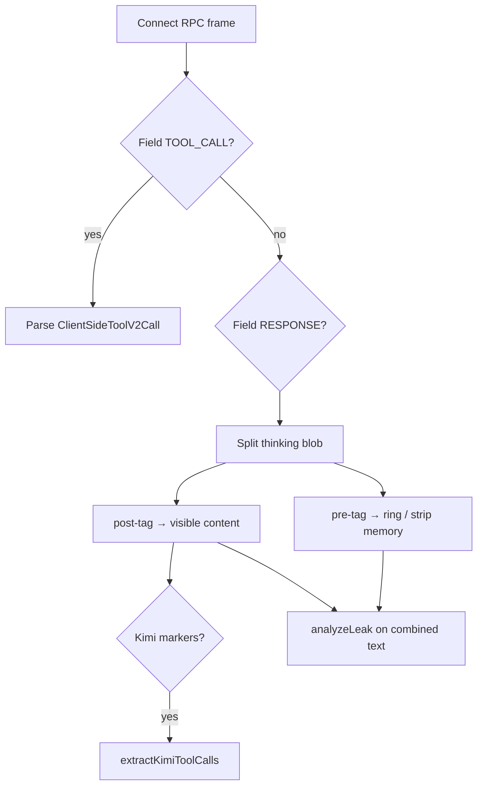

# SapaLOQ — RE: Cursor Thinking & Tools (L0 Ground Truth)

> Reverse-engineering notes dari **sumber langsung** — bukan dari 9router.
> 9router **skip/collapse** thinking Cursor; jangan jadi referensi behavior thinking.
> Last updated: 2026-06-19

Related: [BRIDGE.md](./BRIDGE.md) · [LIMITATIONS.md](./LIMITATIONS.md)

Artefak workspace: `cursor-agent-toolcall-spec.json` · `cursor-agent-toolcall-index.json`

---

## Source hierarchy (wajib)

| Layer | Repo / path | Role untuk SapaLOQ |
|-------|-------------|-------------------|
| **L0** | `cursor-proto-lab` → `api2.cursor.sh` | Wire truth: `content`, `thinking`, `toolCall` terpisah |
| **L0** | `cursor-agent` CLI bundle (`agent.v1.*` protobuf) | ToolCall 49 variants, thinking message fields |
| **L0.5** | `cursor-bridge.schema.json` | kimiTokens, leakMarkers, coercion, probe test matrix |
| **L0.5** | `natural-probes-report.json`, `layered-regression-report.json` | Live probe snapshots |
| **❌ Bukan truth** | 9router `open-sse/executors/cursor.js` | Transport adapter — **membuang** pre-tag thinking, tidak emit `reasoning_content` |

Regenerate / audit:

```bash
# cursor-bridge monorepo (sibling clone)
npm run probe -- cu/default
node scripts/thinking-risk-live-audit.mjs
node scripts/natural-probes.mjs
```

---

## Wire protocol (api2)

Endpoint: `StreamUnifiedChatWithTools` (Connect RPC + protobuf frames, HTTP/2).

Per frame, `extractTextFromResponse` mengembalikan **salah satu**:

| Frame kind | Protobuf | Output |
|------------|----------|--------|
| Tool call | Field `TOOL_CALL` (1) → `ClientSideToolV2Call` | `{ toolCall }` — no text/thinking |
| Chat delta | Field `RESPONSE` (2) → nested | `{ text?, thinking? }` |

Nested response:

| Subfield | Field # | Isi |
|----------|---------|-----|
| `RESPONSE_TEXT` | — | Visible assistant text |
| `THINKING` | 25 | Nested message |
| `THINKING_TEXT` | 1 (dalam THINKING) | Reasoning blob (string) |

Request side: `THINKING_LEVEL` (field 49) maps dari `reasoning_effort` (`medium` / `high`).

**Penting:** `content` dan `thinking` adalah **channel terpisah** di L0. Jangan merge sebelum parser layer memutuskan.

---

## Thinking — struktur blob

### Segmen dalam `THINKING_TEXT`

Live probes (`natural-probes-report.json`, model `default` / Auto) menunjukkan pola:

```text
[pre-tag — internal monologue, often English]
</think>
[post-tag — visible reply ke user, bisa ID/EN]
<｜tool▁calls▁begin｜> ... <｜tool▁calls▁end｜>   ← optional, Kimi inline tools
```

Kadang juga ada token `<|final|>` sebelum visible answer (lihat `layered-regression-report.json`).

### Frekuensi tipikal (Auto / `default`)

| Metrik | Observasi probe |
|--------|-----------------|
| `contentLen` | Sering **0** |
| `thinkingLen` | Sering **ratusan–ribuan** chars |
| `toolCallsCount` (protobuf) | Sering **0** meski model "mau" call tool |
| Tool intent | Muncul di **thinking** (pre-tag) atau Kimi inline **setelah** `</think>` |

### cursor-agent CLI (native)

Dari bundle `~/.local/share/cursor-agent/versions/*/`:

| Signal | Arti |
|--------|------|
| Proto `Thinking` message: `redacted_thinking`, `is_last_thinking_chunk` | Streaming chunks; redacted vs visible split |
| `--show-thinking` | Hanya dengan `--output-format json` |
| Hook `afterAgentThought` | Thinking text terpisah dari response |
| UI `thinkingContent`, `showThinkingBlocks` | Channel sendiri di product — **bukan** collapse ke content |

CLI **tidak** memakai pola "ambil hanya post-`</think>` lalu buang sisanya" seperti adapter proxy.

### Parser SapaLOQ (target)

```go
type CursorThinkingParts struct {
    PreRedacted   string // internal — default: widget ring only, jangan index memory
    PostRedacted  string // visible assistant prefix
    KimiToolTail  string // inline tool section — delegate ke tools/kimi parser
}

func ParseCursorThinking(raw string) CursorThinkingParts
```

| Output | Default policy |
|--------|----------------|
| `PreRedacted` | Stream → ring `thinking`; **strip** dari scribe/SQLite |
| `PostRedacted` | User-visible content |
| `KimiToolTail` | `extractKimiToolCalls` → canonical `ToolCall[]` |

---

## Tools — tiga jalur (Cursor api2)

### 1. Protobuf `ClientSideToolV2Call` (structured)

- Frame field `TOOL_CALL` (1)
- Fields: `toolCallId`, `toolName`, `rawArgs`, `isLast`, optional MCP nested params
- Native di IDE/CLI agent loop — client-side execution, result dikirim balik ke cloud
- Referensi variant map: `cursor-agent-toolcall-spec.json` (49 oneof `agent.v1.ToolCall`)

### 2. Kimi inline tokens (sering di Auto)

Muncul **di dalam string** (thinking atau post-tag content), bukan OpenAI `tool_calls[]`:

```text
<｜tool▁calls▁begin｜>
<｜tool▁call▁begin｜>
glob_file_search
<｜tool▁sep｜>glob_pattern
**/package.json
<｜tool▁call▁end｜>
<｜tool▁calls▁end｜>
```

Marker canonical: `cursor-bridge.schema.json` → `provider.kimiTokens[]`.

Args format:
- Multiline key/value: `key\nvalue\n<|tool_sep|>key2\nvalue2`
- Exec shortcut: `command\n...`
- JSON wrapper dengan `input` string nested

**Auto/default:** `toolCallsCount: 0` di protobuf + Kimi inline di text = **normal**, bukan parse failure.

### 3. Tool catalog "leak" (poisoning — bukan callable tool)

Model sometimes dumps tool schemas / native names in **thinking** (pre-tag), especially when `tools[]` not declared to api2:

- `thinkingOnlyHeuristic`: `thinkingLen > 0 && contentLen === 0`
- Leak scan harus `combineAssistantText(content, thinking)` — **content-only audit miss**

`cursor-bridge` `analyzeLeak` + `leakMarkers` / `nativeTools` — bukan executable tool calls.

---

## Model `default` / Auto — behavior khusus

| Aspek | Behavior |
|-------|----------|
| Upstream model id | `"default"` (server picks backend — often Kimi-class) |
| Protobuf tools | Often absent (`toolCallsCount: 0`) |
| Inline Kimi tools | Common after visible reply segment |
| Thinking-heavy | Long pre-tag, short or zero `RESPONSE_TEXT` |
| Tool poisoning | Higher when bridge declares no `tools[]` |

Probe contoh (`natural-probes-report.json`):

- Prompt ID: `memory-recall` → `contentLen: 0`, `thinkingLen: 920`, Kimi `glob_file_search` inline
- Prompt ID: `find-package-json` → reasoning pre-tag, post-tag ID, then `Glob` inline call

---

## Superficies: IDE vs CLI vs api2 headless

| Surface | Tools | Thinking | Notes |
|---------|-------|----------|-------|
| **IDE** | Full native + bundled MCP (`browser_*`) | UI thinking blocks | `browser_*` = bundled MCP, not api2 native |
| **CLI** (`cursor agent`) | `agent.v1.ToolCall` exec loop | `--show-thinking` json | Same protobuf family as api2 |
| **api2 headless** | Protobuf + Kimi inline fallback | Separate `thinking` channel | Probe target for SapaLOQ bridge |

Schema: `cursor-bridge.schema.json` → `clients.cursorAgent.tools` + `bundledMcp`.

---

## Anti-pattern: jangan tiru 9router untuk thinking

9router `CursorExecutor` (transport layer — **bukan** Cursor spec):

| Behavior 9router | Masalah |
|------------------|---------|
| Akumulasi `totalThinking` tapi **tidak** emit `reasoning_content` SSE | Client tidak dapat thinking stream |
| `visibleContentFromThinking`: hanya teks **setelah** `</think>` → `content` | Pre-tag reasoning **dibuang** |
| Buffered SSE (parse full buffer, few chunks) | Tidak incremental; ring UX mati |
| `empty_completion` jika thinking panjang tanpa post-tag | User lihat blank |

`thinking-risk-live-audit.mjs` flags:

- `no_reasoning_stream_today: reasoning.length === 0`
- `empty_completion_if_no_postTag: !postTag && raw.thinking.length > 0`

**SapaLOQ cursor-bridge driver** harus:

1. Preserve **dual channel** (`thinking` vs `content`) sampai parser layer
2. Stream pre-tag ke widget ring (optional `--show-thinking` parity)
3. Parse Kimi inline dari **gabungan** thinking+content setelah segment split
4. Leak-detect on `content + thinking`, bukan content saja

9router boleh tetap referensi untuk **Kimi arg normalization** (`normalizeCursorToolCallArguments`) — bukan thinking lifecycle.

---

## Decision tree (implementasi SapaLOQ)



---

## Implications for `llmBridge` + parsers

| Component | Config | Notes |
|-----------|--------|-------|
| `parse/thinking/cursor` | `parsers.thinking: cursor` | Split `</think>`, handle `<\|final\|>` |
| `parse/tools/cursor` | protobuf path | From `TOOL_CALL` frames |
| `parse/tools/kimi` | inline path | After thinking split; sync `kimiTokens` schema |
| `bridge/coercion` | `coercion.enabled` | Fake tool names → declared bridge tools |
| Widget ring | orchestrator progress | `type: thinking` from **pre-tag stream**, not collapsed content |

---

## Test vectors (minimum)

| ID | Assert |
|----|--------|
| `auto-thinking-only` | `content=""`, `thinking>0`, no false empty completion |
| `auto-kimi-inline` | `toolCallsCount=0` + inline markers → parsed tools |
| `thinking-leak-pre-tag` | Native tool names in pre-tag → leak detected, not executed |
| `proto-tool-call` | Frame TOOL_CALL → structured tool without Kimi parse |
| `post-tag-visible` | Text after `</think>` → user content |
| `no-9router-collapse` | Pre-tag preserved in thinking channel until explicit strip |

Vectors live: `cursor-bridge/schema/test-vectors/` + probe reports in monorepo.

---

## Explicit non-goals

| Idea | Why |
|------|-----|
| Derive thinking behavior from 9router | Skips channel — documented above |
| Treat `content` only for tool leak audit | Leaks live in thinking |
| Assume Auto emits OpenAI `tool_calls[]` | Kimi inline is normal |
| Store pre-tag thinking in companion memory | Privacy + poisoning — ring/stream only unless user opts in |

---

## Related files (outside sapaloq/)

| Path | Role |
|------|------|
| `/apps/other/cursor-bridge/packages/cursor-proto-lab/src/probe.js` | L0 probe |
| `/apps/other/cursor-bridge/packages/cursor-proto-lab/src/protobuf/cursorProtobuf.js` | Frame decode |
| `/apps/other/cursor-bridge/natural-probes-report.json` | Auto/Kimi live snapshots |
| `/apps/other/cursor-bridge/scripts/thinking-risk-live-audit.mjs` | L0 vs 9router gap audit |
| `/apps/workspace/cursor-agent-toolcall-spec.json` | 49 ToolCall variants (CLI) |
| `/apps/workspace/scripts/extract-cursor-agent-toolcall-spec.py` | Regenerator |
